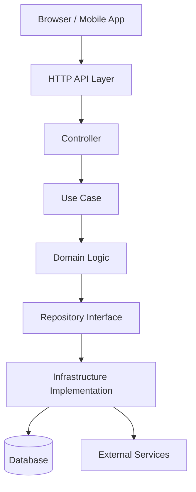
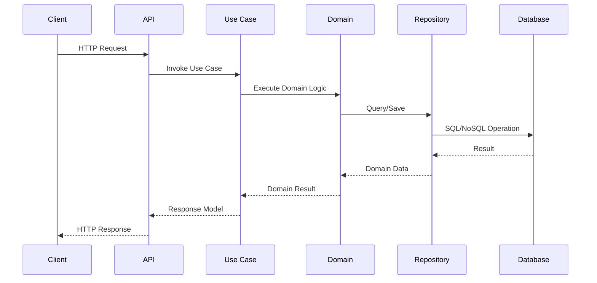
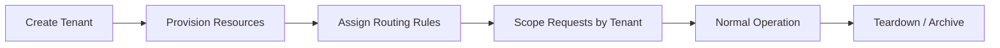

# 🧱 Architecture — Modular Backbone of Business As Usual

## A clean, scalable foundation for a multi‑tenant business platform.

This document explains how the backend is structured, how modules interact, and why the architecture is designed the way it is. Every layer has a clear purpose, every dependency flows inward, and every module is built to scale without accumulating cruft.
This is the authoritative reference for contributors working on the backend.

# 🧩 Layered Architecture Overview

Business As Usual follows a Clean Architecture approach with strict boundaries between layers. Each layer has a single responsibility and depends only on the layers inward from it.
Presentation → Application → Domain ← Infrastructure

## Presentation Layer (WebAPI)

• 	ASP.NET Core controllers
• 	Request/response models
• 	Validation (FluentValidation or filters)
• 	Exception handling and middleware
• 	Authentication/authorization endpoints

This layer contains no business logic — it orchestrates requests and delegates work to the Application layer.

## Application Layer

• 	Use cases (commands, queries, handlers)
• 	Interfaces for repositories, services, and external dependencies
• 	DTOs and mapping profiles
• 	Business workflows and orchestration logic

The Application layer is pure logic with no framework dependencies.
It defines what the system does, not how it does it.

## Domain Layer

• 	Entities
• 	Value objects
• 	Enums
• 	Domain events
• 	Business rules and invariants

This is the heart of the system — completely framework‑agnostic and portable.
The Domain layer should never depend on Application or Infrastructure.

## Infrastructure Layer
• 	EF Core DbContext and migrations
• 	Repository implementations
• 	External service integrations (email, storage, payments, etc.)
• 	Configuration loading
• 	Background services
• 	Multi‑tenant provisioning logic

Infrastructure implements the interfaces defined in Application.
It wires the system together but contains no business rules.

## Cross‑Cutting Concerns

Shared behaviors that apply across layers:
• 	Logging
• 	Caching
• 	Authentication & authorization
• 	Error handling
• 	Telemetry
• 	Rate limiting
• 	Multi‑tenant scoping

These are implemented in Infrastructure or Presentation but designed to be reusable across modules.

# 🏗️ Modular Structure

Each major business capability (HR, Orders, Inventory, Billing, Scheduling, etc.) is implemented as a module with its own:

• 	Domain models
• 	Application use cases
• 	Infrastructure services
• 	API endpoints

Modules are isolated but share the same architectural rules.
This keeps the system scalable and prevents cross‑module coupling.

# 🧭 Multi‑Tenant Architecture

Business As Usual uses a database‑per‑tenant model.

### Key components:

• 	Provisioning Service

### Creates new tenant databases, applies migrations, seeds initial data.

• 	Tenant Resolver

### Determines the active tenant based on domain, header, or token.

• 	Scoped DbContext Factory

Ensures each request uses the correct tenant database.
This approach provides strong isolation and predictable scaling.

# 🐳 Dockerized Flow

The backend is fully containerized for local development and production deployment.
Docker Highlights

• 	Each layer lives in its own project folder
• 	Dockerfile builds the API with environment‑specific configs
• 	Health endpoints (, ) confirm readiness
• 	Supports AWS deployment (EC2 + RDS)
• 	Works seamlessly with docker‑compose for local dev
This ensures consistent environments across contributors and servers.

# 🧠 Design Principles

The architecture is guided by a few core principles:

## Clean Architecture

• 	Dependency inversion
• 	Separation of concerns
• 	Testability
• 	Framework independence

## SOLID

• 	Single Responsibility
• 	Interface Segregation
• 	Dependency Inversion

## Future‑Proofing

The system is designed to support:

• 	Additional modules
• 	Mobile app integration
• 	Multi‑tenant scaling
• 	Cloud‑native deployments
• 	Event‑driven workflows

# 🧱 UI Shell Architecture (High‑Level Overview)

### The frontend layout is documented in detail in  (frontend section), but here’s the backend‑relevant summary:

|       Top Bar        | Tenant, Search, Profile      |
|----------------------|------------------------------|
|       Sidebar        | Module Navigation            |
|     Main Content     | Module Pages & Workflows     |

Backend modules expose endpoints that map cleanly to this UI structure.

# 📁 Related Documentation

- Theme System: /docs/Themes/README.md
- Branding: /docs/BRANDING.md
- Metadata: /docs/METADATA.md
- Onboarding: /docs/ONBOARDING.md
- Changelog: /docs/CHANGELOG.md

# 📓 Contributor Notes

- Log architecture changes in CHANGELOG.md
- Reference LICENSE.md for backend protection
- Sync with frontend via shared DTOs or API contracts
- Keep modules isolated and follow Clean Architecture boundaries

# 🔄 Request Lifecycle

# 🏢 Multi‑Tenant Lifecycle

# 🧭 “How to Read This Architecture” (Contributor Quickstart)

### How This Architecture Works

This backend follows a layered, modular structure:

- **API Layer** handles HTTP and shapes input/output.
- **Application Layer** coordinates use cases and enforces workflows.
- **Domain Layer** contains pure business logic with no framework dependencies.
- **Infrastructure Layer** implements persistence and external integrations.

Each module follows the same pattern:
/ModuleName
  /Domain
  /Application
  /Infrastructure
  /API
This makes the system predictable, testable, and easy to extend.

📦 Layer Responsibilities Table
| Layer          | Responsibilities                             | Examples                                      |
|----------------|----------------------------------------------|-----------------------------------------------|
| API            | Routing, request/response shaping            | Controllers, DTOs                             |
| Application    | Use cases, orchestration, validation         | UseCase classes, service coordinations        |
| Domain         | Pure business logic, entities, value objects | Entities, aggregates, domain services         |
| Infrastructure | Persistence, external APIs, adapters         | Repositories, DB clients, email/SMS providers |
