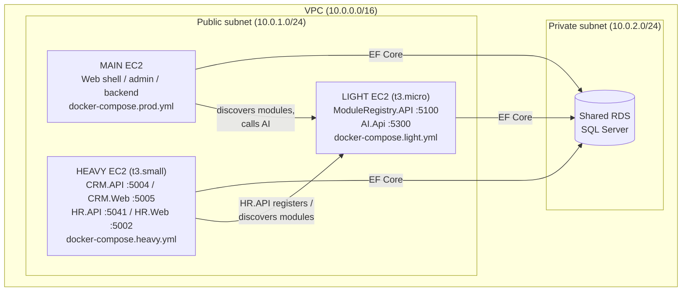

# Business As Usual — Three-Instance (Microservices) AWS Deployment

This guide covers the **microservices topology**: the app is split across **three EC2
instances** that all share **one RDS (SQL Server) database**. It is the companion to
[`AWSDEPLOYMENT.md`](./AWSDEPLOYMENT.md) (the original single-instance guide) and is
referenced from the `docker-compose.*.yml` files.

> TL;DR
> - **Main** instance (existing box): Web shell / admin / primary backend — `docker-compose.prod.yml`
> - **Heavy** instance: CRM.API, CRM.Web, HR.API, HR.Web — `docker-compose.heavy.yml`
> - **Light** instance: ModuleRegistry.API, AI.Api — `docker-compose.light.yml`
> - **One shared RDS** used by all three.

---

## 1. Topology at a glance



### Why this split

- **Heavy** hosts the request-heavy CRM/HR services and their web front-ends. Give it the
  most memory (2 GB / `t3.small`).
- **Light** hosts service discovery (`ModuleRegistry`) and the AI assistant, which are
  lower-traffic (1 GB / `t3.micro`).
- **Main** keeps doing what it already does; it just points at the Light instance for module
  discovery and AI.
- Keeping **one RDS** avoids extra database cost and keeps a single source of truth.

---

## 2. Instance sizing & port map

| Instance | Suggested type | RAM | Services (host → container) |
|----------|----------------|-----|-----------------------------|
| Main     | existing box   | —   | Web shell / admin / backend (unchanged) |
| Heavy    | `t3.small`     | 2 GB | CRM.API `5004→80`, CRM.Web `5005→80`, HR.API `5041→80`, HR.Web `5002→80` |
| Light    | `t3.micro`     | 1 GB | ModuleRegistry.API `5100→80`, AI.Api `5300→80` |

> **On "t3.mini":** AWS has no such size. The closest 2 GB option is `t3.small`; the smallest
> is `t3.micro` (1 GB). Four .NET containers on 1 GB is very tight, so the Heavy box should be
> `t3.small`. Per-container memory limits are already set in `docker-compose.heavy.yml`
> (512M for the APIs, 384M for the web apps).

---

## 3. Security groups

All cross-service traffic should stay on **private IPs inside the VPC**. Only expose to the
public internet what the Main instance / Nginx actually needs.

### Heavy instance SG

| Direction | Port | Source | Purpose |
|-----------|------|--------|---------|
| Inbound   | 22   | your IP / bastion | SSH |
| Inbound   | 5004, 5005, 5041, 5002 | Main instance SG (private) | Web shell → CRM/HR |
| Outbound  | 1433 | RDS SG | EF Core → shared RDS |
| Outbound  | 5100 | Light instance SG (private) | HR.API → Module Registry |
| Outbound  | 443  | 0.0.0.0/0 | Docker pulls, package installs |

### Light instance SG

| Direction | Port | Source | Purpose |
|-----------|------|--------|---------|
| Inbound   | 22   | your IP / bastion | SSH |
| Inbound   | 5100 | Heavy SG + Main SG (private) | Module Registry discovery |
| Inbound   | 5300 | Main SG (private) | Web shell → AI |
| Outbound  | 1433 | RDS SG | AI company gate + registry → shared RDS |
| Outbound  | 443  | 0.0.0.0/0 | Docker pulls, GitHub Models, Amazon Bedrock |

### RDS instance SG

| Direction | Port | Source | Purpose |
|-----------|------|--------|---------|
| Inbound   | 1433 | Main SG, Heavy SG, Light SG | SQL from the three instances only |

> Reference SGs **by security-group id**, not by CIDR, so the rules keep working if private
> IPs change.

---

## 4. Secrets & configuration

Each instance reads a local `.env` file (never committed). Templates are provided:

| Instance | Template | Compose file |
|----------|----------|--------------|
| Main  | [`.env.prod.example`](../.env.prod.example)  | `docker-compose.prod.yml`  |
| Heavy | [`.env.heavy.example`](../.env.heavy.example) | `docker-compose.heavy.yml` |
| Light | [`.env.light.example`](../.env.light.example) | `docker-compose.light.yml` |

### Key variables

| Variable | Used by | Notes |
|----------|---------|-------|
| `AWS_SQL_CONNECTION_STRING` | Main, CRM.API, AI.Api | Shared RDS / provisioning master DB. Use the **RDS endpoint**, not `localhost`. |
| `HR_SQL_CONNECTION_STRING`  | HR.API, HR.Web | Shared RDS, HR database. |
| `MRS_SQL_CONNECTION_STRING` | ModuleRegistry.API | Shared RDS, registry database. Set `MRS_USE_INMEMORY=false` to persist. |
| `MODULE_REGISTRY_URL` | HR.API, Main shell | Light instance **private** IP/DNS, e.g. `http://10.0.2.15:5100`. |
| `AI_SERVICE_URL` | Main shell | Light instance private IP/DNS, e.g. `http://10.0.2.15:5300`. |
| `AI_DEMO_APIKEY` | AI.Api | GitHub Models token (`github_pat_…`) for the free/demo tier. |
| `AI_PAID_REGION` / `AI_PAID_MODEL` | AI.Api | Amazon Bedrock region + model id (defaults provided). |

> **Bedrock credentials:** prefer attaching an **IAM role** with `bedrock:InvokeModel` to the
> Light instance rather than putting static AWS keys in `.env`.

Example connection string:

```
Server=bau-db.abc123.us-east-1.rds.amazonaws.com,1433;Database=BusinessAsUsual;User Id=admin;Password=CHANGE_ME;Encrypt=True;TrustServerCertificate=True;
```

---

## 5. Deploy flow (CI/CD)

Two GitHub Actions workflows deploy the new instances. Each one **generates `.env` on the
runner** (so `${{ secrets.* }}` expands correctly), `rsync`s the repo to the instance, then
runs `docker compose … up -d --build`.

| Workflow | Target | Triggers |
|----------|--------|----------|
| [`deploy-heavy.yml`](../.github/workflows/deploy-heavy.yml) | Heavy | manual + push to `main` touching `services/CRM/**`, `services/HR/**`, `docker-compose.heavy.yml` |
| [`deploy-light.yml`](../.github/workflows/deploy-light.yml) | Light | manual + push to `main` touching `services/ModuleRegistry/**`, `services/AI/**`, `docker-compose.light.yml` |

### Required repository secrets

**Heavy:** `HEAVY_EC2_HOST`, `HEAVY_EC2_SSH_KEY`, `AWS_SQL_CONNECTION_STRING`,
`HR_SQL_CONNECTION_STRING`, `MODULE_REGISTRY_URL`.

**Light:** `LIGHT_EC2_HOST`, `LIGHT_EC2_SSH_KEY`, `AWS_SQL_CONNECTION_STRING`,
`MRS_SQL_CONNECTION_STRING`, `AI_DEMO_APIKEY`. Optional: `AI_PAID_REGION`, `AI_PAID_MODEL`.

> **Why generate `.env` on the runner?** Expanding secrets inside a remote SSH heredoc is
> fragile (the variables expand on the wrong host or not at all). Building the file on the
> runner and copying it over is reliable and keeps secrets out of the repo.

---

## 6. Manual deploy (first time / no CI)

On each instance (Amazon Linux 2023, Docker + Compose installed — see the base guide):

```bash
# Heavy instance
git clone https://github.com/cruckman900/BusinessAsUsual.git
cd BusinessAsUsual
cp .env.heavy.example .env      # fill in real RDS strings + MODULE_REGISTRY_URL
docker compose -f docker-compose.heavy.yml up -d --build
```

```bash
# Light instance
git clone https://github.com/cruckman900/BusinessAsUsual.git
cd BusinessAsUsual
cp .env.light.example .env      # fill in RDS strings + AI_DEMO_APIKEY
docker compose -f docker-compose.light.yml up -d --build
```

**Deploy order:** bring up **Light first** (so `ModuleRegistry` and `AI` are reachable), then
**Heavy** (HR.API registers with the registry on startup), then update **Main** with the
Light instance's private URLs.

---

## 7. Verify

```bash
# Light instance
curl http://localhost:5100/health      # Module Registry
curl http://localhost:5300/health      # AI (reports which tiers are configured)

# Heavy instance
curl http://localhost:5004/health      # CRM.API
curl http://localhost:5041/health      # HR.API

# From the Heavy instance, confirm it can reach the Light instance privately
curl http://LIGHT_PRIVATE_IP:5100/health
```

Check container status and logs:

```bash
docker compose -f docker-compose.heavy.yml ps
docker compose -f docker-compose.heavy.yml logs -f hr-api
```

---

## 8. Shared RDS notes

- All three instances point at the **same RDS endpoint**; only the `Database=` name differs
  per service (`BusinessAsUsual`, `BusinessAsUsual_HR`, `BusinessAsUsual_ModuleRegistry`).
- The APIs auto-apply EF Core migrations **only in Development**. In Production, apply
  migrations deliberately (run the service once with the dev profile, or run
  `dotnet ef database update` against RDS from a trusted host).
- Keep RDS in the **private subnet** with no public IP; only the three instance SGs may reach
  port 1433.

---

## 9. Cost notes

- Two extra `t3.small`/`t3.micro` instances + one shared RDS — no NAT gateway, no load
  balancer required for this phase.
- The AI demo tier uses GitHub Models (free) by default; the paid tier (Bedrock) is only hit
  for provisioned companies, so idle cost stays near zero.
- Memory limits in the compose files protect the small instances from OOM under load.

---

### Related docs
- [`AWSDEPLOYMENT.md`](./AWSDEPLOYMENT.md) — original single-instance guide (VPC, Nginx, HTTPS, Certbot, ops playbooks).
