```md
BUSINESS AS USUAL
POWERED BY LINEAR DESCENT 
AWS • DOCKER • NGINX • HTTPS • SECRETS MANAGER
```

---

# 🏢 Business As Usual — Production Deployment & Operations Guide
A fully containerized, multi‑tenant SaaS platform deployed on AWS EC2 with Nginx, HTTPS, Docker Compose, and AWS Secrets Manager.
Designed for production reliability, contributor‑proof onboarding, and enterprise‑grade observability
This guide documents the production‑grade deployment pipeline, scaling strategy, observability stack, and operational playbooks that power the BAU platform.

Designed for:

- Reliability  
- Maintainability  
- Contributor‑proof onboarding  
- Enterprise observability  
- Zero‑downtime updates

---

```bash
   ,     #_
   ~\_  ####_        Amazon Linux 2023
  ~~  \_#####\
  ~~     \###|
  ~~       \#/ ___   https://aws.amazon.com/linux/amazon-linux-2023
   ~~       V~' '->
    ~~~         /
      ~~._.   _/
         _/ _/
       _/m/'
```


# Table of Contents (TODO: this TOC starts close to the bottom of the document. fill in the top portion)

- [Scaling the EC2 Instance](#-scaling-the-ec2-instance)
  - [When to Scale](#when-to-scale)
  - [Recommended Instance Types](#recommended-instance-types)
  - [How to Scale](#how-to-scale)
  - [Cost Breakdown](#cost-breakdown)

- [AWS Secrets Manager Setup](#-aws-secrets-manager-setup)
  - [Secret Name](#secret-name)
  - [Required Keys](#required-keys)
  - [IAM Policy](#iam-policy)
  - [Testing Secret Loading](#testing-secret-loading)

- [Health Endpoints](#-health-endpoints)
  - [/health](#health)
  - [/ready](#ready)
  - [Nginx Upstream Health Checks](#nginx-upstream-health-checks)

- [Logging & Monitoring](#-logging--monitoring)
  - [Serilog Setup](#serilog-setup)
  - [Docker Log Access](#docker-log-access)
  - [Optional: Seq Container](#optional-seq-container)
  - [Admin Dashboard Integration](#admin-dashboard-integration)

- [Snapshotting the Environment (AMI)](#-snapshotting-the-environment-ami)
  - [When to Snapshot](#when-to-snapshot)
  - [How to Snapshot](#how-to-snapshot)
  - [Restoring](#restoring)

- [EC2 Update Playbook](#-ec2-update-playbook)
  - [Pull Latest Code](#pull-latest-code)
  - [Rebuild Containers](#rebuild-containers)
  - [Validate](#validate)
  - [Check Logs](#check-logs)

- [Crash Testing Procedures](#-crash-testing-procedures)
  - [Rapid Restart](#rapid-restart)
  - [SQL Server Cold Start](#sql-server-cold-start)
  - [CPU Spike](#cpu-spike)
  - [Memory Pressure](#memory-pressure)
  - [Nginx Routing Test](#nginx-routing-test)
  - [Blazor Circuit Stability](#blazor-circuit-stability)

- [Admin Site Enhancements (Planned)](#-admin-site-enhancements-planned)
  - [System Health Dashboard](#system-health-dashboard)
  - [Logs Viewer](#logs-viewer)
  - [Environment Panel](#environment-panel)
  - [Crash Test Tools](#crash-test-tools)
  - [Metrics](#metrics)

# ✅ SECTION 1 — VPC, Subnets, and Routing Tables

## Understanding the Network Layout

Business As Usual runs inside a clean, cost‑safe AWS network architecture built around a single VPC. The VPC provides an isolated, software‑defined network where all compute and database resources live. Within that VPC, we intentionally separate infrastructure into two subnets:

- A public subnet for the EC2 instance
- A private subnet for the RDS database

This separation ensures that only the application server is exposed to the internet, while the database remains fully isolated and reachable only from inside the VPC.

## Public Subnet (10.0.1.0/24)

This subnet contains the EC2 instance running:

- Docker
- NGINX
- ASP.NET Core
- Background services
- Certbot (for HTTPS renewal)

The public subnet is associated with a public route table that includes:

```
0.0.0.0/0 → Internet Gateway
```

This gives the EC2 instance outbound internet access (for package installs, Docker pulls, Certbot challenges) and allows inbound HTTPS traffic from the public internet.

## Private Subnet (10.0.2.0/24)

This subnet contains the RDS instance. It has:

- No public IP
- No route to the internet
- No inbound access from outside the VPC

The private route table intentionally omits any 0.0.0.0/0 route, ensuring the database is reachable only from internal resources such as the EC2 instance.

## Why This Matters

This layout gives you:

- A secure, production‑grade network boundary
- A database that is never exposed publicly
- A cost‑safe architecture (no NAT Gateway required)
- A clear separation of concerns for future scaling

```mermaid
flowchart TB
    subgraph VPC["VPC (10.0.0.0/16)"]
        
        subgraph Public_Subnet["Public Subnet (10.0.1.0/24)"]
            EC2[EC2 Instance<br/>Docker + ASP.NET Core]
            IGW[Internet Gateway]
            RT_Public[Public Route Table<br/>0.0.0.0/0 → IGW]
        end

        subgraph Private_Subnet["Private Subnet (10.0.2.0/24)"]
            RDS[(RDS Database)]
            RT_Private[Private Route Table<br/>No Internet Route]
        end
    end

    EC2 --> RT_Public
    RT_Public --> IGW

    EC2 --> RDS
    RDS --> RT_Private
```



---

# ✅ SECTION 2 — DNS → EC2 → Application → Database Request Path

## How Traffic Reaches the Application

When a user visits https://businessasusual.work, the request flows through several AWS components before reaching your application. Understanding this path helps contributors troubleshoot DNS, SSL, routing, and application behavior.

## 1. Route 53 Resolves the Domain

Your domain is hosted in Route 53. The hosted zone contains:

- An A record pointing to the EC2 public IP
- (Optional) AAAA record for IPv6
- Nameservers registered with your domain registrar

When a browser looks up your domain, Route 53 returns the EC2 instance’s public IP.

## 2. Browser Sends HTTPS Request to EC2

The user’s browser connects directly to your EC2 instance.
There is no load balancer in Phase 1 to keep costs low.

## 3. NGINX Terminates TLS and Routes Traffic

NGINX handles:

- TLS termination
- Static file serving
- Reverse proxying to ASP.NET Core
- ACME challenge responses for Certbot

## 4. ASP.NET Core Handles Business Logic

Your application processes the request, executes business rules, and prepares a response.

## 5. EF Core Communicates with RDS

All database operations occur through EF Core, using a secure, internal VPC connection to the RDS instance in the private subnet.

## 6. Response Returns to the User

ASP.NET Core returns JSON, HTML, or API responses back through NGINX to the user’s browser.


---

# ✅ SECTION 3 — HTTPS, Certbot, and Auto‑Renewal Lifecycle

## Why HTTPS Matters

Your application uses HTTPS to ensure encrypted communication between users and the server. Certificates are issued by Let’s Encrypt and automatically renewed using Certbot.

## Initial Certificate Issuance

During setup, Certbot performs an HTTP‑01 challenge, which requires:

- NGINX to serve a temporary challenge file
- Let’s Encrypt to validate that your EC2 instance controls the domain

Once validated, Certbot installs the certificate and configures NGINX to use it.

## Automatic Renewal

A nightly cron job runs:

```
certbot renew
```

Certbot checks certificate expiration and, if renewal is needed:

- Requests a new ACME challenge
- Places the challenge file in /.well-known/acme-challenge
- Lets NGINX serve the challenge
- Receives the renewed certificate
- Reloads NGINX to apply the update

## Zero Downtime

NGINX reloads gracefully, ensuring:

- No dropped connections
- No downtime
- Seamless certificate rotation

---

# Business As Usual – AWS Deployment Log

## 1. Goal

Deploy the **Business As Usual** SaaS application to **Amazon Web Services (AWS)** using a cost-conscious, résumé-ready architecture:

- Single **EC2 t3.micro** instance
- Docker + docker-compose
- Domain: `https://businessasusual.work`
- DNS via **Route 53**
- HTTPS via **AWS Certificate Manager (ACM)**
- No NAT Gateway, no load balancer, no surprise billing


This document captures the exact steps taken to stand up the environment.

---

## 2. Account and region

- **AWS Account ID:** 283784618079
- **Plan:** Upgraded from free tier to paid
- **Region:** `us-east-1` (N. Virginia) (chosen for low latency and broad service support)

---

## 3. EC2 instance provisioning

### 3.1. Instance details

- **Service:** Amazon EC2
- **Instance type:** `t3.micro`
- **AMI:** (chosen at deploy time)
  - Option A: Amazon Linux 2023
  - Option B: Ubuntu Server 22.04 LTS
- **Storage:** 16–30 GB gp3
- **Network:** Default VPC
- **Subnet:** Public subnet
- **Security group:**
  - Allow SSH from my IP (`22/tcp`)
  - Allow HTTP (`80/tcp`)
  - Allow HTTPS (`443/tcp`)

### 3.2. SSH access

- Generated or selected an existing key pair.
- Connected via:

```bash
ssh -i /path/to/key.pem ec2-user@<EC2_PUBLIC_IP>   # Amazon Linux
# or
ssh -i /path/to/key.pem ubuntu@<EC2_PUBLIC_IP>     # Ubuntu
```

## 4. Install Docker and Docker Compose (Ubuntu 22.04)

With the EC2 instance provisioned and accessible via SSH, the next step is to install Docker and Docker Compose. These tools allow the entire Business As Usual stack to run in isolated containers, ensuring consistent behavior across development, staging, and production environments.

### 4.1. Update system packages

```bash
sudo apt update && sudo apt upgrade -y
```

# Install Docker Engine

```bash
sudo apt install -y docker.io
sudo systemctl enable docker
sudo systemctl start docker
sudo usermod -aG docker $USER
```

# Verify Docker Installation

```bash
docker --version
docker ps
```

# Install Docker Compose

```bash
sudo curl -L "https://github.com/docker/compose/releases/download/v2.29.0/docker-compose-$(uname -s)-$(uname -m)" -o /usr/local/bin/docker-compose
sudo chmod +x /usr/local/bin/docker-compose
docker-compose version
```

# Confirm Installation

```bash
docker --version
docker-compose version
```

## 5. Deploying Business As Usual on EC2

With Docker and Docker Compose installed, the next step is to deploy the Business As Usual application onto the EC2 instance.

### 5.1. Clone the repository

From the EC2 terminal:

```bash
git clone https://github.com/cruckman900/BusinessAsUsual.git
cd BusinessAsUsual
```

### 5.2. Environment configuration

```bash
cp .env.example .env

docker-compose up -d --build
docker ps
```

# Test the application locally on EC2

```bash
curl http://localhost
```

## 6. Assign Elastic IP and configure DNS (Route 53)

To ensure a stable public endpoint for the application, an Elastic IP is attached to the EC2 instance and mapped to the custom domain via Route 53.


### 6.1. Allocate and associate an Elastic IP

1. Open the **EC2** console.
2. Navigate to **Network & Security → Elastic IPs**.
3. Click **Allocate Elastic IP address** and confirm.
4. Select the newly allocated Elastic IP and choose **Actions → Associate Elastic IP address**.
5. Associate it with:
   - **Resource type:** Instance
   - **Instance:** The Business As Usual EC2 instance

Record the Elastic IP address for DNS configuration.

### 6.2. Configure Route 53 DNS

1. Open the **Route 53** console.
2. Go to **Hosted zones** and select the hosted zone for `businessasusual.work`.
3. Create or update the following records:

- **Root domain**

  - Type: `A`
  - Name: `businessasusual.work`
  - Value: `<Elastic_IP>`

- **Optional subdomains**
  - `api.businessasusual.work` → `<Elastic_IP>`
  - `admin.businessasusual.work` → `<Elastic_IP>`

### 6.3. Verify DNS resolution

From a local machine:

```bash
ping businessasusual.work
```

You should see the Elastic IP address in the response.
Once DNS propagates, visiting http://businessasusual.work should reach the EC2 instance.

## 7. Enable HTTPS for Business As Usual

To provide secure access, HTTPS is enabled for the domain. For Phase 1, TLS termination is handled directly on the EC2 instance using Nginx and Let’s Encrypt.
Note: A future phase may move TLS termination to an AWS Application Load Balancer with ACM certificates.

### 7.1. Install Nginx

On the EC2 instance:

```bash
sudo apt update
sudo apt install -y nginx
sudo systemctl enable nginx
sudo systemctl start nginx
```

### 7.2. Configure Nginx as a reverse proxy

Create or edit a site configuration, for example:

```bash
sudo nano /etc/nginx/sites-available/businessasusual
```

Example configuration:

```Nginx
server {
    listen 80;
    server_name businessasusual.work www.businessasusual.work;

    location / {
        proxy_pass http://localhost:80; # or the internal port your app exposes
        proxy_set_header Host $host;
        proxy_set_header X-Real-IP $remote_addr;
        proxy_set_header X-Forwarded-For $proxy_add_x_forwarded_for;
        proxy_set_header X-Forwarded-Proto $scheme;
    }
}
```

Enable the site and reload Nginx:

```bash
sudo ln -s /etc/nginx/sites-available/businessasusual /etc/nginx/sites-enabled/
sudo nginx -t
sudo systemctl reload nginx
```

### 7.3. Install Certbot (Let’s Encrypt)


```bash
sudo apt install -y certbot python3-certbot-nginx
```

### 7.4. Obtain and configure HTTPS certificate

```bash
sudo certbot --nginx -d businessasusual.work -d www.businessasusual.work
```

Follow the prompts to:

- Agree to terms
- Choose HTTP → HTTPS redirection
  Certbot will automatically update the Nginx configuration to use HTTPS.

### 7.5. Verify HTTPS

Visit:

- https://businessasusual.work
  Confirm:
- The site loads
- The browser shows a valid HTTPS certificate

## 8. RDS-ready configuration (future migration)

Although Phase 1 uses a Dockerized database on EC2 to minimize cost, the application is prepared for a future migration to Amazon RDS with minimal changes:

### 8.1. Environment variable strategy

The application reads database configuration from environment variables, for example:

- DB_HOST
- DB_PORT
- DB_USER
- DB_PASSWORD
- DB_NAME

### 8.2. Local Docker database configuration

For Phase 1, .env points to the Docker database container, e.g.:

```Env
DB_HOST=db
DB_PORT=5432
DB_USER=bau_user
DB_PASSWORD=bau_password
DB_NAME=business_as_usual
```

### 8.3. RDS configuration template

Create a separate file, e.g. .env.rds, with placeholders for RDS:

```env
DB_HOST=<rds-endpoint.amazonaws.com>
DB_PORT=5432
DB_USER=<rds_username>
DB_PASSWORD=<rds_password>
DB_NAME=<rds_db_name>
```

When ready to migrate to RDS:

- Create the RDS instance (e.g., PostgreSQL db.t3.micro).
- Update .env.rds with the actual RDS endpoint and credentials.
- Replace .env with .env.rds (or load it via deployment tooling).
- Restart the Docker stack:

```bash
docker-compose down
docker-compose up -d --build
```

This design allows a “flip the switch” migration from local Docker DB to RDS with no code changes.

## 9. Cost-conscious design notes

The deployment is intentionally designed to minimize AWS costs while remaining production-relevant and résumé-ready.

- Single EC2 instance (t3.micro):
- Hosts API, frontend, database (Docker), and Nginx.
- Can be stopped when not in use to reduce compute charges.
- No NAT Gateway:
- Avoids high hourly and data processing costs.
- All necessary traffic flows through the public subnet and security groups.
- No load balancer in Phase 1:
- HTTPS is terminated directly on EC2 via Nginx and Let’s Encrypt.
- An Application Load Balancer can be introduced later if needed.
- No RDS in Phase 1:
- Database runs in a Docker container to avoid idle RDS charges.
- RDS migration is planned and documented for future production hardening.
- Route 53 DNS:
- Low, predictable monthly cost for hosted zone and records.

## 10. Future enhancements and Phase 2 plan

Planned future improvements include:

- Database migration to Amazon RDS:
- Create RDS instance (PostgreSQL or MySQL).
- Migrate schema and data from Docker DB.
- Update environment configuration to point to RDS.
- Tighten security groups to allow DB access only from the EC2 instance.
- Application Load Balancer (ALB) and ACM:
- Move TLS termination to an ALB.
- Use AWS Certificate Manager for managed certificates.
- Enable path-based routing or multiple services behind the ALB.
- Auto-scaling and additional instances:
- Introduce an Auto Scaling Group for the application layer.
- Scale horizontally based on CPU, memory, or request metrics.
- Centralized logging and monitoring:
- Use CloudWatch Logs and metrics.
- Set log retention policies to control storage costs.

## 11. Résumé and portfolio summary

Deployed Business As Usual to AWS using:

- Amazon EC2 (t3.micro) running Ubuntu 22.04 LTS
- Docker + Docker Compose for application and database containers
- Nginx as a reverse proxy and TLS termination point
- Custom domain via Route 53: https://businessasusual.work
- Let’s Encrypt for HTTPS certificates
- Cost-conscious architecture:
- No NAT Gateway
- No load balancer in Phase 1
- No idle RDS charges
- RDS-ready configuration:
- Environment-driven DB configuration
- Documented migration path from Docker DB → Amazon RDS

This deployment demonstrates practical experience with:

- Cloud infrastructure on AWS
- Linux server administration
- Containerized application deployment
- DNS and TLS configuration
- Cost-optimized, production-relevant architecture design

---

# 🚀 Deployment Documentation Additions

## 🧱 Scaling the EC2 Instance

### When to Scale

Scale your EC2 instance when you observe:
- CPU credit exhaustion
- Slow response times under load
- Docker containers exiting unexpectedly
- SQL Server memory pressure
- Nginx becoming unresponsive

### Recommended Instance Types


```
📌 Footnotes
* Costs are approximate on-demand pricing for us-east-1 and may vary slightly by region.
CPU Baseline % refers to the guaranteed CPU performance before burst credits are used.
Unlimited Mode allows instances to exceed baseline without throttling, with small overage charges.
```

### How to Scale

- Stop the instance
- Actions → Instance Settings → Change Instance Type
- Select t3.medium
- Start the instance
- Validate with:

```bash
docker ps
curl -I http://localhost:3000
```

### Cost Breakdown

- t3.small: ~$15–$20/month
- t3.small Unlimited: ~$20–$25/month
- t3.medium: ~$30/month

---

## 🔐 AWS Secrets Manager Setup

### Secret Name

```
BusinessAsUsual/Secrets
```

### Required Keys

```json
{
  "SA_PASSWORD": "YourStrong!Password123",
  "ACCEPT_EULA": "Y",
  "AWS_SQL_CONNECTION_STRING": "Server=db;User Id=sa;Password=YourStrong!Password123;Database=BusinessAsUsual;Encrypt=True;TrustServerCertificate=true;"
}
```

### IAM Policy

```json
{
  "Version": "2012-10-17",
  "Statement": [
    {
      "Effect": "Allow",
      "Action": [
        "secretsmanager:GetSecretValue",
        "secretsmanager:DescribeSecret"
      ],
      "Resource": "arn:aws:secretsmanager:us-east-1:<ACCOUNT-ID>:secret:BusinessAsUsual/Secrets*"
    }
  ]
}
```

### Testing Secret Loading

```
docker logs businessasusual-frontend-1 --tail=50
```

Look for:

```
🔐 ConfigLoader: Loaded SA_PASSWORD=...
```

---

## 🩺 Health Endpoints

### /health

- Returns 200 OK if the service is alive
- No dependency checks

### /ready

Confirms:
- DB reachable
- Secrets loaded
- Migrations applied
- Internal services initialized


### Nginx Upstream Health Checks

```
proxy_next_upstream error timeout http_500 http_502 http_503 http_504;
```

---

## 📊 Logging & Monitoring

### Serilog Setup

- Console sink (Docker logs)
- File sink (optional)
- Seq sink (optional)
- Enrichment:
- Machine name
- Container name
- Request ID
- Tenant
- User

### Docker Log Access

```
docker logs <container> --tail=100
```

### Optional: Seq Container

```Yaml
seq:
  image: datalust/seq
  ports:
    - "5341:80"
```

### Admin Dashboard Integration

Expose:
- Recent logs
- Container health
- CPU usage
- Memory usage
- Uptime
- Secret load status
- DB connection status
- Version/build info

## 📦 Snapshotting the Environment (AMI)

### When to Snapshot

- After a successful deployment
- Before major changes
- Before scaling
- Before database migrations

### How to Snapshot

- EC2 → Instances
- Select BAU instance
- Actions → Image and Templates → Create Image
- Name it:

```
BAU-Production-YYYY-MM-DD
```

- Save

### Restoring
- Launch new instance from AMI
- Attach Elastic IP
- Run:

```
docker-compose up -d
```

## 🔁 EC2 Update Playbook

### Pull Latest Code

```
git pull
```

### Rebuild Containers

```
docker-compose down
docker-compose up -d --build
```

### Validate

```
curl -I http://localhost:3000
curl -I http://localhost:8080
curl -I http://localhost:5000
```

### Check Logs

```
docker logs businessasusual-frontend-1 --tail=50
```

## 💥 Crash Testing Procedures

### Rapid Restar

```
docker-compose down
docker-compose up -d
```

### SQL Server Cold Start

```
docker-compose stop db
docker-compose start db
```

### CPU Spike

```
stress --cpu 2 --timeout 20
```

### Memory Pressure

```
stress --vm 1 --vm-bytes 512M --timeout 20
```

### Nginx Routing Test

```
for i in {1..50}; do curl -I https://businessasusual.work >/dev/null; done
```

### Blazor Circuit Stability

- Rapid refresh
- Multiple tabs
- Idle → resume

---

## 🧭 Admin Site Enhancements (Planned)

### System Health Dashboard

- Container status (running/exited)
- Uptime
- CPU usage
- Memory usage
- Disk usage
- DB connection status
- Secrets load status
- Version/build info

### Logs Viewer

- Tail 100 logs
- Filter by service
- Search
- Auto-refresh

### Environment Panel

- ASPNETCORE_ENVIRONMENT
- Loaded secrets
- Connection strings
- ConfigLoader status

### Crash Test Tools

- Restart a service
- Check DB health
- Check secrets health
- Check Nginx health

### Metrics

- Requests per minute
- Error rate
- Circuit disconnects
- SQL latency
