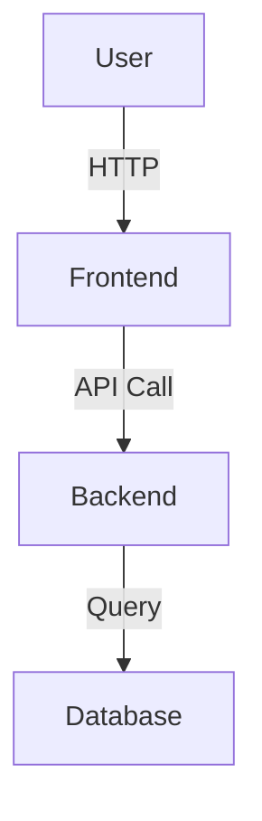

# Chart & Diagram Specifications

This document provides detailed specifications for all charts, diagrams, and visual assets needed in the Business As Usual documentation.

## Creating the Diagrams

**Recommended Tools**:
1. **Draw.io** (https://app.diagrams.net) - Free, web-based
2. **Lucidchart** (https://www.lucidchart.com) - Professional, cloud-based
3. **Microsoft Visio** - If you have access
4. **Mermaid** - Text-based diagrams, export as PNG

**Export Settings**:
- Format: PNG or SVG
- Resolution: 300 DPI for print, 150 DPI for digital
- Size: 8 inches wide (max) to fit within margins
- Background: Transparent or white
- Border: Optional 1px gray border for clarity

---

## Chart 1: High-Level System Architecture

**Location**: Chapter 2, Section 2.1  
**Type**: Architecture Diagram  
**Complexity**: Medium

**Elements to Include**:

```
┌─────────────────────────────────────────────────────────────┐
│                        USERS                                 │
│  (Web Browsers, Mobile Devices, API Clients)               │
└──────────────────────┬──────────────────────────────────────┘
					   │
					   ↓
┌─────────────────────────────────────────────────────────────┐
│                  FRONTEND LAYER                              │
│  ┌──────────┐  ┌──────────┐  ┌──────────┐                  │
│  │ Blazor   │  │ Admin    │  │ Mobile   │                  │
│  │ Web App  │  │ Portal   │  │ App      │                  │
│  └──────────┘  └──────────┘  └──────────┘                  │
└──────────────────────┬──────────────────────────────────────┘
					   │
					   ↓
┌─────────────────────────────────────────────────────────────┐
│              API GATEWAY (Planned)                           │
│  Authentication, Routing, Rate Limiting                      │
└──────────────────────┬──────────────────────────────────────┘
					   │
	   ┌───────────────┼───────────────┬─────────────┐
	   ↓               ↓               ↓             ↓
┌─────────┐     ┌─────────┐     ┌─────────┐   ┌─────────┐
│ HR      │     │ Sales   │     │ Finance │   │ CRM     │
│ Service │     │ Service │     │ Service │   │ Service │
│ API/Web │     │ API/Web │     │ API/Web │   │ API/Web │
└────┬────┘     └────┬────┘     └────┬────┘   └────┬────┘
	 │               │               │             │
	 ↓               ↓               ↓             ↓
┌─────────┐     ┌─────────┐     ┌─────────┐   ┌─────────┐
│ HR      │     │ Sales   │     │ Finance │   │ CRM     │
│ Database│     │ Database│     │ Database│   │ Database│
└─────────┘     └─────────┘     └─────────┘   └─────────┘

	   ┌───────────────┴───────────────┐
	   ↓                               ↓
┌─────────────┐                 ┌─────────────┐
│   Redis     │                 │ Application │
│   Cache     │                 │  Insights   │
└─────────────┘                 └─────────────┘
```

**Colors**:
- Frontend: Light Blue (#E3F2FD)
- API Gateway: Purple (#E1BEE7)
- Services: Green (#C8E6C9)
- Databases: Orange (#FFE0B2)
- Infrastructure: Gray (#EEEEEE)

---

## Chart 2: Module Interaction Map

**Location**: Chapter 2, Section 2.3  
**Type**: Dependency/Flow Diagram  
**Complexity**: High

**Show Relationships**:
```
					┌─────────────┐
					│  Platform   │
					│  (Core)     │
					└──────┬──────┘
						   │
		 ┌─────────────────┼─────────────────┬──────────────┐
		 ↓                 ↓                 ↓              ↓
	┌────────┐        ┌────────┐       ┌────────┐     ┌────────┐
	│   HR   │───────→│  CRM   │──────→│ Sales  │────→│Finance │
	└────────┘        └────────┘       └────────┘     └────────┘
		 │                                   │              │
		 ↓                                   ↓              ↓
	┌────────┐                          ┌────────┐     ┌────────┐
	│ Payroll│                          │Inventory│────→│ A/P,A/R│
	└────────┘                          └────────┘     └────────┘
```

**Arrows Indicate**:
- Solid line: Direct API call
- Dashed line: Event-driven (planned)
- Labels: What data is shared

**Example Labels**:
- HR → CRM: "Employee info for sales team"
- CRM → Sales: "Customer data"
- Sales → Finance: "Invoices"
- Sales → Inventory: "Stock reservations"

---

## Chart 3: User Journey Flowcharts

**Location**: Chapter 11, Section 11.2  
**Type**: Flowchart  
**Complexity**: Medium (Create 5-6 common workflows)

**Workflow 1: Employee Onboarding**
```
Start
  ↓
[HR creates employee record]
  ↓
[System sends welcome email]
  ↓
[Employee sets up account]
  ↓
<Is MFA required?>
  Yes → [Employee enables MFA]
  No  ↓
[Employee completes profile]
  ↓
[Manager assigns initial tasks]
  ↓
End
```

**Workflow 2: Create Sales Quote**
**Workflow 3: Process Payroll**
**Workflow 4: Purchase Order**
**Workflow 5: Customer Service Ticket**
**Workflow 6: Expense Approval**

**Flowchart Key**:
- Rectangle: Process/Action
- Diamond: Decision point
- Oval: Start/End
- Arrow: Flow direction

---

## Chart 4: Database Schema Diagrams

**Location**: Chapter 13, Section 13.3  
**Type**: Entity Relationship Diagram (ERD)  
**Complexity**: High (One per module)

**Example: HR Module Schema**
```
┌─────────────┐         ┌─────────────┐
│  Employee   │1───────N│  TimeOff    │
├─────────────┤         ├─────────────┤
│ Id (PK)     │         │ Id (PK)     │
│ FirstName   │         │ EmployeeId  │
│ LastName    │         │ StartDate   │
│ Email       │         │ EndDate     │
│ HireDate    │         │ Type        │
│ DepartmentId│         │ Status      │
└──────┬──────┘         └─────────────┘
	   │
	   │N
	   │
┌──────┴──────┐
│ Department  │
├─────────────┤
│ Id (PK)     │
│ Name        │
│ ManagerId   │
└─────────────┘
```

**Include for each module**:
- Primary keys (PK)
- Foreign keys (FK)
- Main relationships (1:1, 1:N, M:N)
- Key fields only (not all columns)

---

## Chart 5: Deployment Architecture

**Location**: Chapter 14, Section 14.2  
**Type**: Infrastructure Diagram  
**Complexity**: High

**Cloud Deployment (Azure)**:
```
┌─────────────────────────────────────────────────┐
│              Azure Front Door                    │
│       (CDN, SSL, Load Balancing)                │
└────────────────┬────────────────────────────────┘
				 │
		┌────────┴────────┐
		↓                 ↓
┌──────────────┐   ┌──────────────┐
│ AKS Cluster  │   │ Static Web   │
│ (West US)    │   │ Assets       │
│              │   └──────────────┘
│ ┌──────────┐ │
│ │ HR Pods  │ │
│ ├──────────┤ │
│ │Sales Pods│ │
│ ├──────────┤ │
│ │CRM Pods  │ │
│ └──────────┘ │
└──────┬───────┘
	   │
	   ↓
┌──────────────────────────┐
│  Azure SQL Database      │
│  (Geo-Replicated)        │
└──────────────────────────┘
	   │
	   ↓
┌──────────────────────────┐
│ Azure Cache for Redis    │
└──────────────────────────┘
	   │
	   ↓
┌──────────────────────────┐
│ Application Insights     │
│ Log Analytics            │
└──────────────────────────┘
```

---

## Chart 6: Feature Comparison Matrix

**Location**: Chapter 15, Section 15.2  
**Type**: Table/Matrix  
**Complexity**: Low

**Format**:

| Module | Feature | Status | Release |
|--------|---------|--------|---------|
| **Platform** |
| | User Management | ✅ Completed | v1.0 |
| | Data Import | ✅ Completed | v1.0 |
| | Audit Logging | ✅ Completed | v1.0 |
| | Workflow Engine | 📋 Planned | v1.5 |
| **HR** |
| | Employee Records | ✅ Completed | v1.0 |
| | Payroll | ✅ Completed | v1.0 |
| | Benefits | ✅ Completed | v1.0 |
| | Performance Reviews | 🔧 In Progress | v1.2 |
| | Recruiting (ATS) | 📋 Planned | v2.0 |
| **Sales** |
| | Quotes | ✅ Completed | v1.0 |
| | Orders | ✅ Completed | v1.0 |
| | Invoicing | ✅ Completed | v1.0 |
| | Subscriptions | 📋 Planned | v1.3 |

**Legend**:
- ✅ Completed
- 🔧 In Development
- 📋 Planned

---

## Chart 7: Performance Benchmarks

**Location**: Chapter 14, Section 14.5  
**Type**: Bar Chart / Line Graph  
**Complexity**: Medium

**Metrics to Chart**:

**Response Time (bar chart)**:
- API Endpoints (GET Employee): 45ms avg
- Page Load Time (Employee List): 1.2s
- Search Query (1000 records): 180ms
- Import 500 records: 8s

**Concurrent Users (line graph)**:
- X-axis: Number of users (50, 100, 200, 500)
- Y-axis: Response time (ms)
- Show degradation curve

**Database Performance (bar chart)**:
- Query execution: 50ms avg
- Index seek: 5ms
- Full table scan: 250ms

---

## Chart 8: Technology Stack Diagram

**Location**: Chapter 1, Section 1.5  
**Type**: Layered Diagram  
**Complexity**: Medium

**Layers (top to bottom)**:
```
┌─────────────────────────────────────────────┐
│          USER INTERFACES                     │
│  Blazor WebAssembly │ Blazor Server │ APIs  │
└─────────────────────────────────────────────┘
┌─────────────────────────────────────────────┐
│          FRONTEND FRAMEWORKS                 │
│  MudBlazor │ SignalR │ PWA │ Chart.js      │
└─────────────────────────────────────────────┘
┌─────────────────────────────────────────────┐
│          BACKEND SERVICES                    │
│  ASP.NET Core │ MediatR │ FluentValidation │
└─────────────────────────────────────────────┘
┌─────────────────────────────────────────────┐
│          DATA & PERSISTENCE                  │
│  EF Core │ SQL Server │ Redis │ Azure SQL   │
└─────────────────────────────────────────────┘
┌─────────────────────────────────────────────┐
│          INFRASTRUCTURE                      │
│  Docker │ Kubernetes │ Azure │ GitHub       │
└─────────────────────────────────────────────┘
```

---

## Chart Creation Checklist

For each chart:
- [ ] Create diagram using recommended tool
- [ ] Use consistent colors and styling
- [ ] Export at 300 DPI for print version
- [ ] Export at 150 DPI for digital version
- [ ] Save source file (editable) in `docs/BusinessAsUsualManual/diagrams/source/`
- [ ] Save PNG in `docs/BusinessAsUsualManual/diagrams/exports/`
- [ ] Name files: `chart##-description.png` (e.g., `chart01-system-architecture.png`)
- [ ] Add caption text in Word document below each image
- [ ] Ensure images fit within page margins

---

## Style Guidelines

**Color Palette** (use consistently):
- Primary Blue: #2C5AA0
- Secondary Green: #4CAF50
- Accent Orange: #FF9800
- Warning Yellow: #FFC107
- Error Red: #F44336
- Neutral Gray: #9E9E9E

**Fonts**:
- Headings: Arial Bold, 12pt
- Body text: Arial, 10pt
- Code/technical: Consolas, 9pt

**Shapes**:
- Rounded corners (5px radius) for modern look
- Drop shadows (subtle, 2px offset) for depth
- Consistent spacing (20px between elements)

---

## Example Tools & Commands

### Using Draw.io
1. Go to https://app.diagrams.net
2. Choose "Create New Diagram"
3. Select template or start blank
4. Use toolbar to add shapes
5. Export: File → Export As → PNG (300 DPI)

### Using Mermaid

Render at https://mermaid.live and export as PNG

### Using PowerPoint/Google Slides
1. Create diagram using shapes
2. Right-click slide → Save as Picture
3. Choose PNG format
4. Set custom size: 8" wide

---

This provides specifications for all major charts. Create these diagrams and insert them at the marked locations in the Word document for a professional, comprehensive manual.
