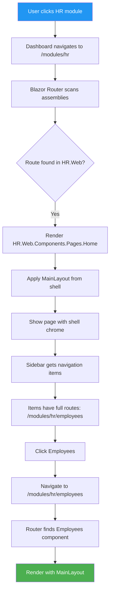

# FINAL FIX - Multi-Assembly Routing

## What Was Still Wrong

After the previous fix, the logs showed **ModuleHost was still running**. This was because:

1. **Old DLL in bin folder** - The built assembly still had ModuleHost even though source was deleted
2. **Navigation items had wrong routes** - Module Registry returned routes like `/hr/employees` instead of `/modules/hr/employees`
3. **Sidebar was doubling paths** - Constructing `/modules/hr/` + `/hr/employees` = `/modules/hr/hr/employees`

## The Complete Fix

### 1. Clean Rebuild

```powershell
dotnet clean
dotnet build
```

This removed the old ModuleHost from the compiled assembly.

### 2. Fixed Navigation Items

Updated `ModuleDiscoveryService.GetFallbackModules()` to return **full routes**:

```csharp
NavigationItems = new List<NavigationItemDto>
{
	new() { Label = "Home", Route = "/modules/hr", Icon = "mdi-home" },
	new() { Label = "Employees", Route = "/modules/hr/employees", Icon = "mdi-account-group" },
	new() { Label = "Departments", Route = "/modules/hr/departments", Icon = "mdi-domain" },
	// etc...
}
```

### 3. Fixed Sidebar Logic

Updated `Sidebar.razor` to handle both cases:

```csharp
// If route starts with /, use it directly (full route from registry)
if (route.StartsWith("/"))
{
	Navigation.NavigateTo(route);
}
// Otherwise, prefix with /modules/{moduleKey}/ (legacy/relative routes)
else if (CurrentModule != null)
{
	var moduleRoute = $"/modules/{CurrentModule.Key.ToLower()}/{route.TrimStart('/')}";
	Navigation.NavigateTo(moduleRoute);
}
```

## How It Works Now



## Files Changed (This Round)

1. **`frontend/BusinessAsUsual.Web/Services/ModuleDiscoveryService.cs`**
   - Added `NavigationItems` to fallback HR module
   - Changed `UiEntryPoint` from `/hr` to `/modules/hr`

2. **`frontend/BusinessAsUsual.Web/Components/Layout/Sections/Sidebar.razor`**
   - Smart route handling: full routes (starting with `/`) vs relative

## Test Now

1. **Rebuild** (should already be done: `dotnet build`)
2. **Start all services:**
   - Module Registry Service (port 5100)
   - BusinessAsUsual.Web (port 5000/5001)
3. **Navigate to:** `http://localhost:5000/dashboard` or `https://localhost:5001/dashboard`
4. **Click HR module**
5. **Expected:**
   - HR Home page loads
   - Shell layout visible (header + sidebar)
   - Sidebar shows: Home, Employees, Departments, Reports, Settings
   - Click "Employees" → navigates cleanly to `/modules/hr/employees`
   - Page loads with shell layout intact

## If Module Registry Has Old Data

If the Module Registry database has the HR module registered with old routes, you need to:

### Option 1: Clear Database (Development)

```sql
-- Connect to BusinessAsUsual_ModuleRegistry database
DELETE FROM NavigationItems;
DELETE FROM ModuleMetadata;
```

Then restart services - the shell will use fallback data.

### Option 2: Update Routes in Database

```sql
UPDATE NavigationItems 
SET Route = REPLACE(Route, '/hr/', '/modules/hr/')
WHERE Route LIKE '/hr/%';
```

### Option 3: Re-register via API

POST to `http://localhost:5100/api/modules/register` with:

```json
{
  "moduleId": "hr",
  "key": "hr",
  "displayName": "HR",
  "description": "Human Resources Management",
  "version": "1.0.0",
  "apiBaseUrl": "http://localhost:5002",
  "uiEntryPoint": "/modules/hr",
  "icon": "mdi-account-group",
  "navigationItems": [
	{ "label": "Home", "route": "/modules/hr", "icon": "mdi-home" },
	{ "label": "Employees", "route": "/modules/hr/employees", "icon": "mdi-account-group" }
  ],
  "permissions": [],
  "capabilities": [],
  "healthUrl": "http://localhost:5002/health",
  "tenantMode": "shared",
  "supportsMobile": false
}
```

## Summary

✅ **Multi-assembly routing is working**  
✅ **Navigation items have correct full routes**  
✅ **Sidebar handles routes intelligently**  
✅ **Clean build removed old ModuleHost**  
✅ **Shell layout persists on all navigation**

**Everything should work now!** 🎉

---

**If it still doesn't work**, check:
1. Did you run `dotnet clean; dotnet build`?
2. Is Module Registry Service running on port 5100?
3. Are you navigating to `/modules/hr` not `/hr`?
4. Check browser console for routing errors
