# Business As Usual — Microservice Architecture Overview

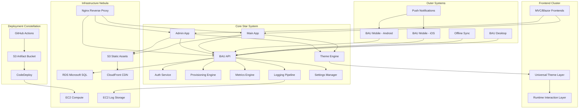

---

<details>
<summary><strong>📘 Table of Contents</strong></summary>

---

## 🧭 Overview & Purpose
- [Purpose of This Document](#purpose-of-this-document)
- [Why BAU Uses a Microservice Architecture](#why-bau-uses-a-microservice-architecture)
- [What “Module = Microservice” Means](#what-module--microservice-means)
- [How Services Communicate](#how-services-communicate)
  - [1. Synchronous API Calls](#1-synchronous-api-calls)
  - [2. Asynchronous Events](#2-asynchronous-events)
- [How the UI Discovers Modules](#how-the-ui-discovers-modules)
- [Tenant Isolation Strategy](#tenant-isolation-strategy)
- [How Modules Handle Cross‑Domain Data](#how-modules-handle-crossdomain-data)

---

## 🏛️ Module Registry Service (MRS)
- [Purpose](#purpose)
- [Responsibilities](#responsibilities)
- [Module Metadata Model](#module-metadata-model)
- [Module Registration Flow](#module-registration-flow)
- [Discovery Endpoints](#discovery-endpoints)
- [Health Checking](#health-checking)
- [Multi‑Tenant Routing](#multitenant-routing)
- [Security](#security)
- [Deployment Model](#deployment-model)
- [Why MRS Matters](#why-mrs-matters)

---

## 🚪 API Gateway & Routing Strategy
- [Purpose](#purpose-1)
- [Responsibilities](#responsibilities-1)
- [Routing Model](#routing-model)
- [Tenant Resolution](#tenant-resolution)
- [Authentication & Authorization](#authentication--authorization)
- [Request Aggregation](#request-aggregation-optional)
- [Health & Diagnostics](#health--diagnostics)
- [Deployment Model](#deployment-model-1)
- [Why the Gateway Matters](#why-the-gateway-matters)

---

## 🧩 BAU Microservice Template
- [Purpose](#purpose-2)
- [Folder Structure](#folder-structure)
- [Layer Responsibilities](#layer-responsibilities)
- [Required Endpoints](#required-endpoints)
- [Health Checks](#health-checks)
- [Logging Standards](#logging-standards)
- [Database Rules](#database-rules)
- [Event Publishing](#event-publishing)
- [Event Subscribing](#event-subscribing)
- [Module Registration](#module-registration)
- [Deployment Expectations](#deployment-expectations)
- [Example Minimal Module](#example-minimal-module)

---

## ⏱️ Example Microservice: Timekeeping
- [Purpose](#purpose-3)
- [Domain Overview](#domain-overview)
- [Folder Structure](#folder-structure-1)
- [Data Model](#data-model-simplified)
- [API Surface](#api-surface)
- [Tenant Handling](#tenant-handling)
- [Integration with Other Modules](#integration-with-other-modules)
- [Events](#events)
- [UI Integration](#ui-integration)
- [Health & Diagnostics](#health--diagnostics-1)
- [Deployment](#deployment)
- [Summary](#summary-1)

---

## 🗄️ Database Strategy — Tenant‑Per‑Database
- [Purpose](#purpose-4)
- [Core Principles](#core-principles)
- [Database Naming Convention](#database-naming-convention)
- [Migrations](#migrations)
- [Cross‑Module Data Access](#crossmodule-data-access)
- [Local Read Models](#local-read-models)
- [Backup & Restore](#backup--restore)
- [Scaling Strategy](#scaling-strategy)
- [Why This Strategy Works](#why-this-strategy-works)

---

## 🔔 Event‑Driven Architecture
- [Purpose](#purpose-5)
- [Core Concepts](#core-concepts)
- [Architecture Overview](#architecture-overview)
- [Event Flow](#event-flow)
- [Example: Business Provisioning](#example-business-provisioning)
- [Why This Matters](#why-this-matters)

---

## 📱 Impact on Mobile Apps
- [Key Advantages](#key-advantages)
- [Summary](#summary-2)

---

## 🖼️ Diagrams
- [Diagram 1 — High‑Level Architecture](#-diagram-1---high-level-architecture-diagram)
- [Diagram 2 — Deployment Pipeline](#-diagram-2---deployment-pipeline-github---aws---ec2)
- [Diagram 3 — Network Topology](#️-diagram-3---network-topology-vpc-subnets-routing)
- [Diagram 4 — Service Dependency Graph](#-diagram-4---service-dependency-graph)
- [Diagram 5 — Database Schema](#️-diagram-5---database-schema-erd-style-mermaid)
- [Diagram 6 — User Login Sequence](#-diagram-6---user-login-sequence-flow)
- [Diagram 7 — Tech Stack Grid](#-diagram-7---tech-stack-grid)
- [Diagram 8 — Nginx Reverse Proxy Routing](#-diagram-8---nginx-reverse-proxy-routing)
- [Diagram 9 — System Metric Pipeline](#-diagram-9---system-metric-pipeline-collectors---api---dashboard)
- [Diagram 10 — Provisioning Wizard Flow](#-diagram-10---provisioning-wizard-flow-business-creation--module-setup)
- [Diagram 11 — API Routing Map](#️-diagram-11---api-routing-map-domain-organized-endpoints)
- [Diagram 12 — Theme Engine Architecture](#-diagram-12---multi-tenant-theme-engine-architecture)
- [Diagram 13 — Admin Dashboard Layout](#-diagram-13---admin-dashboard-layout-architecture)
- [Diagram 14 — Logging & Diagnostics Pipeline](#-diagram-14---logging--diagnostics-pipeline)
- [Diagram 15 — Configuration & Settings Flow](#️-diagram-15---configuration--settings-flow)
- [Diagram 16 — Authentication Token Lifecycle](#-diagram-16---authentication-token-lifecycle)
- [Diagram 17 — Static Assets Delivery Pipeline](#-diagram-17---static-assets-delivery-pipeline)
- [Diagram 18 — Full Deployment Pipeline](#-diagram-18---full-deployment-pipeline-github---aws---ec2---nginx)
- [Diagram 19 — Error Handling & Recovery Flow](#️-diagram-19---error-handling--recovery-flow)
- [Diagram 20 — Module & Submodule Hierarchy](#-diagram-20---module--submodule-heirarchy-erp-structure)
- [Diagram 21 — Full System Overview](#-diagram-21---full-system-overview-all-components)
- [Diagram 22 — Future Mobile Architecture](#-diagram-22---future-mobile-architecture-android--ios)
- [Diagram 23 — Mobile Navigation Flow](#-diagram-22---mobile-navigation-flow-android--ios)
- [Diagram 24 — Offline Sync Architecture](#-diagram-23---offline-sync-architecture)
- [Diagram 25 — Database Schema](#-diagram-24---database-schema-high-level-erd)
- [Diagram 26 — Request Lifecycle](#-diagram-25---request-lifecycle-frontend--api--db--response)

---

- [Service Catalog](#service-catalog)
- [Event Catalog](#event-catalog)
- [Deployment Topology](#deployment-topology)
- [Local Development Workflow](#local-development-workflow)

</details>

---

## Purpose of This Document
This document provides a complete, contributor‑ready overview of the Business As Usual (BAU) microservice architecture. It explains how modules are structured, how services communicate, how data flows between domains, and how the platform achieves scalability, resilience, and tenant isolation.

## Why BAU Uses a Microservice Architecture
BAU is designed to support many business types, each with unique operational needs. A monolithic architecture would become rigid, slow to evolve, and difficult for contributors to extend. Microservices allow BAU to:

- Scale individual modules independently  
- Deploy updates without affecting unrelated features  
- Maintain clear domain boundaries  
- Support tenant‑per‑database isolation  
- Allow contributors to build new modules without touching the core system  

Each module is a self‑contained service with its own API, database, and deployment lifecycle.

## What “Module = Microservice” Means
In BAU, a *module* is a fully independent microservice. Each module:

- Owns its own data  
- Exposes a REST API  
- Registers itself with the Module Registry Service (MRS)  
- Publishes and consumes domain events  
- Provides optional UI components that the Admin/Main apps can load dynamically  

Modules do not share databases. Modules communicate through APIs and events.

## How Services Communicate
BAU uses two communication patterns:

### 1. Synchronous API Calls
Modules expose REST endpoints for real‑time queries and commands.  
Example: The Orders module may call the Products module to retrieve product details.

### 2. Asynchronous Events
Modules publish events when their data changes.  
Other modules subscribe and maintain local read‑optimized copies of the data they need.

This avoids cross‑database joins and keeps modules decoupled.

## How the UI Discovers Modules
The Admin and Main applications do not hard‑code module lists.  
Instead, they query the Module Registry Service (MRS), which returns:

- Available modules  
- Module metadata  
- API base URLs  
- UI component URLs  
- Permissions and capabilities  

This allows modules to be added or removed without modifying the core UI.

## Tenant Isolation Strategy
BAU uses a **tenant‑per‑database** model.  
Each module connects to the tenant’s database using credentials resolved at runtime.

This ensures:

- Strong data isolation  
- Easy data export/import  
- Per‑tenant scaling  
- Clean separation of concerns  

Modules never share databases, even within the same tenant.

## How Modules Handle Cross‑Domain Data
Modules never join across databases.  
Instead, they compose data through:

- API calls  
- Event‑driven local read models  
- Hybrid caching strategies  

This ensures performance, resilience, and clean domain boundaries.

---

# Module Registry Service (MRS)

## Purpose
The Module Registry Service (MRS) is the central directory for all BAU modules. It allows the Admin and Main applications to dynamically discover available modules, retrieve metadata, load UI components, and route API calls without hard‑coding any module information.

MRS enables BAU to remain modular, extensible, and plug‑and‑play. New modules can be added, updated, or removed without modifying the core applications.

## Responsibilities
The MRS is responsible for:

- Registering modules when they come online  
- Storing module metadata  
- Providing module discovery endpoints  
- Validating module health  
- Exposing API base URLs for routing  
- Exposing UI component URLs for dynamic loading  
- Managing module permissions and capabilities  
- Supporting multi‑tenant routing rules  

The MRS does **not** store business data. It only stores module metadata.

## Module Metadata Model
Each module registers itself with the following metadata:

- `moduleId` — Unique identifier (e.g., "orders")  
- `displayName` — Human‑readable name  
- `description` — Short summary of the module  
- `version` — Semantic version of the module  
- `apiBaseUrl` — Base URL for the module’s API  
- `uiEntryPoint` — URL to the module’s UI bundle (optional)  
- `permissions` — List of permissions the module exposes  
- `capabilities` — Feature flags or module‑specific capabilities  
- `healthUrl` — Endpoint used for health checks  
- `tenantMode` — How the module handles tenant isolation (e.g., tenant‑per‑db)  

This metadata is stored in the MRS database and returned to clients on request.

## Module Registration Flow
1. A module starts up.  
2. It sends a `POST /modules/register` request to the MRS.  
3. The MRS validates the payload.  
4. The MRS stores or updates the module metadata.  
5. The MRS begins periodic health checks.  
6. The module becomes discoverable by Admin/Main apps.

Modules may re‑register at any time (e.g., after deployment).

## Discovery Endpoints

### `GET /modules`
Returns a list of all registered modules with their metadata.

### `GET /modules/{moduleId}`
Returns metadata for a specific module.

### `GET /modules/active`
Returns only modules that are currently healthy and available.

### `GET /modules/ui`
Returns a list of modules that expose UI components.

### `GET /modules/capabilities`
Returns a flattened list of all module capabilities.

These endpoints allow the Admin/Main apps to dynamically build navigation, load UI bundles, and route API calls.

## Health Checking
The MRS performs periodic health checks using each module’s `healthUrl`.

A module is considered **healthy** if:

- The health endpoint returns HTTP 200  
- The module responds within the timeout window  
- The module’s version matches the expected schema version (optional rule)  

Unhealthy modules are excluded from the `/modules/active` list.

## Multi‑Tenant Routing
The MRS does not store tenant data.  
Instead, it provides routing metadata that allows clients to:

- Resolve the correct API base URL  
- Determine whether a module uses tenant‑per‑database  
- Pass tenant identifiers to the module  

Each module is responsible for connecting to the correct tenant database.

## Security
The MRS enforces:

- API key or JWT authentication for module registration  
- Role‑based access for Admin/Main discovery endpoints  
- Validation of module metadata  
- Optional signature validation for UI bundles  

The MRS does not handle user authentication; it only manages module metadata.

## Deployment Model
The MRS is deployed as a standalone microservice with:

- Its own database  
- Its own API  
- Its own health checks  
- Its own CI/CD pipeline  

It must be online before any other module can register.

## Why MRS Matters
Without the MRS:

- The Admin/Main apps would require hard‑coded module lists  
- Adding new modules would require code changes  
- Modules could not be independently deployed  
- UI composition would break  
- Routing would be brittle and error‑prone  

The MRS is the backbone of BAU’s modular architecture.

---

# API Gateway & Routing Strategy

## Purpose
The API Gateway is the single entry point for all client requests in the BAU ecosystem. It centralizes routing, authentication, authorization, tenant resolution, and request forwarding to individual modules. This ensures that modules remain simple, independent, and focused on their domain logic.

The gateway allows BAU to maintain a clean, scalable, and secure microservice architecture.

## Responsibilities
The API Gateway handles:

- Routing requests to the correct module  
- Injecting tenant context into requests  
- Validating authentication tokens  
- Enforcing authorization rules  
- Rate limiting and throttling  
- Logging and request tracing  
- Aggregating responses when needed  
- Providing a stable public API surface  

Modules do not expose their APIs directly to clients. All traffic flows through the gateway.

## Routing Model
The gateway uses module metadata from the Module Registry Service (MRS) to determine routing rules.

### Example Routing Pattern

```
/api/{moduleId}/{resource}/{id?}
```

Examples:
- `/api/orders/create`
- `/api/products/123`
- `/api/customers/search`

The gateway resolves `{moduleId}` using the MRS and forwards the request to the module’s `apiBaseUrl`.

## Tenant Resolution
The gateway is responsible for determining the active tenant for each request.

Tenant resolution may use:

- JWT claims  
- Subdomain (e.g., `tenant1.businessasusual.work`)  
- Query parameters (fallback)  
- Admin‑selected tenant context  

Once resolved, the gateway injects tenant metadata into the forwarded request:

- `X-Tenant-Id`  
- `X-Tenant-Database` (optional)  
- `X-Tenant-User`  

Modules use this metadata to connect to the correct tenant database.

## Authentication & Authorization
The gateway validates:

- Access tokens  
- Refresh tokens  
- Role claims  
- Module‑specific permissions  

Authorization rules are derived from:

- User roles  
- Module permissions (from MRS)  
- Capability flags  

Unauthorized requests never reach the modules.

## Request Aggregation (Optional)
Some UI screens require data from multiple modules.  
The gateway may provide aggregation endpoints to reduce client round‑trips.

Example:

```
GET /api/dashboard/overview
```

This endpoint may internally call:

- Orders module  
- Products module  
- Customers module  

Aggregation is used sparingly to avoid coupling.

## Health & Diagnostics
The gateway exposes:

- `/health` — basic health  
- `/metrics` — performance metrics  
- `/routes` — active routing table  
- `/modules` — cached module metadata  

This helps contributors debug routing issues.

## Deployment Model
The gateway is deployed as a standalone service with:

- Its own CI/CD pipeline  
- Horizontal scaling  
- Load balancer integration  
- Caching layer for module metadata  

It must be online for the platform to function.

## Why the Gateway Matters
Without the gateway:

- Clients would need to know every module’s URL  
- Authentication would be duplicated across modules  
- Tenant resolution would be inconsistent  
- Modules would be exposed directly to the internet  
- Routing changes would break clients  

The gateway provides stability, security, and simplicity across the entire BAU ecosystem.

---

# BAU Microservice Template

## Purpose
This template defines the required structure, conventions, and behaviors for all BAU microservices (modules). Every module must follow this standard to ensure consistency, maintainability, and seamless integration with the BAU ecosystem.

The template covers:
- Folder structure  
- Required endpoints  
- Health checks  
- Logging  
- Database rules  
- Event publishing/subscribing  
- Module registration  
- Deployment expectations  

This document serves as the blueprint for contributors building new modules.

---

# Folder Structure

```
/src
	/ModuleName.Api
	/ModuleName.Application
	/ModuleName.Domain
	/ModuleName.Infrastructure
	/tests
		/ModuleName.Tests
	/docker
	/scripts
	README.md

```

### Layer Responsibilities

**ModuleName.Api**  
- Controllers  
- Request/response models  
- Authentication/authorization  
- Tenant context extraction  
- API versioning  

**ModuleName.Application**  
- Use cases  
- Command handlers  
- Query handlers  
- Validation  
- DTO mapping  

**ModuleName.Domain**  
- Entities  
- Value objects  
- Domain events  
- Aggregates  
- Business rules  

**ModuleName.Infrastructure**  
- Database context  
- Repositories  
- Event bus integration  
- External service clients  
- Migrations  

---

# Required Endpoints

Every module must expose the following endpoints:

### `GET /health`
Returns module health status.

### `GET /info`
Returns:
- Module ID  
- Version  
- Description  
- Capabilities  
- Build timestamp  

### `POST /register`
Used during startup to register with the Module Registry Service (MRS).

### Domain Endpoints
Each module defines its own domain endpoints following REST conventions:

```
GET    /{resource}
GET    /{resource}/{id}
POST   /{resource}
PUT    /{resource}/{id}
DELETE /{resource}/{id}
```

---

# Health Checks

Each module must implement:

- Database connectivity check  
- External dependency check (if applicable)  
- Event bus connectivity check  
- Internal service check  

Health endpoint must return:

```json
{
  "status": "Healthy",
  "details": {
	"database": "Healthy",
	"eventBus": "Healthy",
	"externalService": "Healthy"
  }
}
```

Unhealthy modules are excluded from `/modules/active` in the MRS.

---

# Logging Standards

Modules must use structured logging with:

- Correlation ID  
- Tenant ID  
- User ID  
- Module ID  
- Request path  
- Execution time  
- Error details  

Log levels:
- `Information` for normal operations  
- `Warning` for recoverable issues  
- `Error` for failures  
- `Critical` for outages  

Logs must be JSON‑formatted for ingestion by centralized logging.

---

# Database Rules

Each module owns its own database schema.

Rules:
- No cross‑module tables  
- No foreign keys to other modules  
- No shared schemas  
- No distributed joins  
- Migrations must be idempotent  
- Tenant‑per‑database connection strings resolved at runtime  

Modules may maintain **local read models** populated via events.

---

# Event Publishing

Modules publish domain events when meaningful changes occur.

Example events:
- `OrderCreated`
- `ProductUpdated`
- `CustomerActivated`

Event payloads must include:
- Event ID  
- Timestamp  
- Module ID  
- Tenant ID  
- Version  
- Payload  

Events must be versioned to avoid breaking consumers.

---

# Event Subscribing

Modules may subscribe to events from other modules.

Rules:
- Subscribers must handle unknown fields gracefully  
- Subscribers must be idempotent  
- Subscribers must not block the event bus  
- Subscribers must update local read models only  
- Subscribers must not perform cross‑module writes  

---

# Module Registration

On startup, each module must call:

```
POST /modules/register
```

Payload includes:
- moduleId  
- displayName  
- description  
- version  
- apiBaseUrl  
- uiEntryPoint (optional)  
- permissions  
- capabilities  
- healthUrl  
- tenantMode  

Modules must re‑register on deployment.

---

# Deployment Expectations

Each module must support:

- Independent deployment  
- Zero‑downtime restarts  
- Rolling updates  
- Health‑based load balancer removal  
- Environment‑based configuration  
- CI/CD pipeline integration  

Modules must not assume:
- Shared memory  
- Shared caches  
- Shared databases  
- Shared configuration files  

---

# Example Minimal Module

```
ModuleName.Api/
	Controllers/
		ResourceController.cs
	Program.cs
	appsettings.json

ModuleName.Application/
	Commands/
	Queries/
	Validators/

ModuleName.Domain/
	Entities/
	Events/
	ValueObjects/

ModuleName.Infrastructure/
	Db/
	Repositories/
	EventBus/
	Migrations/
```

---

# Summary
This template ensures that every BAU module is:

- Independent  
- Consistent  
- Scalable  
- Testable  
- Discoverable  
- Tenant‑aware  
- Event‑driven  

Following this standard guarantees that new modules integrate seamlessly into the BAU ecosystem.

---

# Example Microservice: Timekeeping

## Purpose
The Timekeeping module manages employee time entries, shifts, and approvals. It is a standalone microservice that follows the BAU microservice template and integrates with other modules (e.g., Employees, Projects, Payroll) via APIs and events.

This example demonstrates how a real module is structured, how it exposes its API, how it handles tenant isolation, and how it participates in the event‑driven ecosystem.

---

## Domain Overview

The Timekeeping module is responsible for:

- Recording time entries for employees  
- Associating time with projects, jobs, or cost centers  
- Managing shift rules and schedules  
- Handling approvals (supervisor, manager, payroll)  
- Publishing events for downstream consumers (e.g., Payroll)  

It does **not** own employee master data or payroll rules. Those belong to other modules.

---

## Folder Structure

The Timekeeping module follows the standard BAU microservice template:

```
/src
	/Timekeeping.Api
	/Timekeeping.Application
	/Timekeeping.Domain
	/Timekeeping.Infrastructure
	/tests
		/Timekeeping.Tests
	/docker
	/scripts
	README.md

```

---

## Data Model (Simplified)

### Core Entities

**TimeEntry**
- `Id`  
- `TenantId`  
- `EmployeeId`  
- `ProjectId` (optional)  
- `CostCenterId` (optional)  
- `StartTime`  
- `EndTime`  
- `DurationMinutes`  
- `EntryType` (e.g., Regular, Overtime, PTO)  
- `Status` (Draft, Submitted, Approved, Rejected)  
- `CreatedAt`  
- `ApprovedAt` (optional)  

**Shift**
- `Id`  
- `TenantId`  
- `Name`  
- `StartTime`  
- `EndTime`  
- `IsOvernight`  
- `IsFlexible`  

**Approval**
- `Id`  
- `TenantId`  
- `TimeEntryId`  
- `ApproverId`  
- `Status` (Pending, Approved, Rejected)  
- `Comment`  
- `Timestamp`  

The Timekeeping database is tenant‑per‑database and owned exclusively by this module.

---

## API Surface

Base path (via gateway):

```
/api/timekeeping
```

### Time Entries

**GET `/api/timekeeping/time-entries`**  
Returns a paged list of time entries for the current tenant (and optionally filtered by employee, date range, status).

**GET `/api/timekeeping/time-entries/{id}`**  
Returns a single time entry.

**POST `/api/timekeeping/time-entries`**  
Creates a new time entry.

**PUT `/api/timekeeping/time-entries/{id}`**  
Updates an existing time entry (if not yet approved).

**POST `/api/timekeeping/time-entries/{id}/submit`**  
Submits a time entry for approval.

**POST `/api/timekeeping/time-entries/{id}/approve`**  
Approves a time entry.

**POST `/api/timekeeping/time-entries/{id}/reject`**  
Rejects a time entry.

### Shifts

**GET `/api/timekeeping/shifts`**  
Returns defined shifts.

**POST `/api/timekeeping/shifts`**  
Creates a new shift definition.

### System Endpoints

**GET `/api/timekeeping/health`**  
Health check.

**GET `/api/timekeeping/info`**  
Module metadata (ID, version, capabilities).

---

## Tenant Handling

The Timekeeping module does not determine the tenant itself.  
It receives tenant context from the API Gateway via headers:

- `X-Tenant-Id`  
- `X-Tenant-Database` (optional)  

The Infrastructure layer uses this context to:

- Resolve the correct connection string  
- Connect to the tenant’s Timekeeping database  
- Apply tenant filters to all queries  

No cross‑tenant data is ever mixed.

---

## Integration with Other Modules

### Employees (via API)

The Timekeeping module does **not** store full employee records.  
Instead, it:

- Stores `EmployeeId` as a foreign key (logical, not DB‑level to another module)  
- Calls the Employees module when it needs employee details  

Example call (from Application layer):

- `GET /api/employees/{employeeId}`

### Projects / Jobs (via API or Events)

For project or job context, Timekeeping can:

- Call the Projects module API for real‑time details  
- Or maintain a local read model populated by `ProjectUpdated` events  

### Payroll (via Events)

When time entries are approved, Timekeeping publishes events:

- `TimeEntryApproved`
- `TimeEntryRejected`

The Payroll module subscribes and uses these events to calculate pay.

---

## Events

### Published Events

**TimeEntryCreated**
- `eventId`  
- `timestamp`  
- `moduleId: "timekeeping"`  
- `tenantId`  
- `version`  
- `payload`:
  - `timeEntryId`  
  - `employeeId`  
  - `startTime`  
  - `endTime`  
  - `durationMinutes`  
  - `entryType`  

**TimeEntryApproved**
- `eventId`  
- `timestamp`  
- `moduleId: "timekeeping"`  
- `tenantId`  
- `version`  
- `payload`:
  - `timeEntryId`  
  - `employeeId`  
  - `approvedAt`  
  - `durationMinutes`  
  - `entryType`  

### Subscribed Events (Example)

**EmployeeUpdated** (from Employees module)  
Used to update local read models for employee display names or statuses.

**ProjectUpdated** (from Projects module)  
Used to update local project references for reporting.

---

## UI Integration

The Timekeeping module may expose a UI bundle:

- `uiEntryPoint`: URL to a Timekeeping SPA or micro‑frontend

The Admin/Main apps:

1. Query the MRS for modules with UI components.  
2. Discover Timekeeping’s `uiEntryPoint`.  
3. Dynamically load the Timekeeping UI into the shell (e.g., under “Time & Attendance”).

The Timekeeping UI communicates only with the gateway (`/api/timekeeping/...`), never directly with the module.

---

## Health & Diagnostics

**GET `/api/timekeeping/health`** checks:

- Database connectivity  
- Event bus connectivity  
- External dependencies (if any)  

**GET `/api/timekeeping/info`** returns:

- `moduleId: "timekeeping"`  
- `version`  
- `description`  
- `capabilities` (e.g., `["time-entry", "shift-management", "approvals"]`)  

These endpoints are used by:

- MRS for health status  
- Admin tools for diagnostics  

---

## Deployment

The Timekeeping module:

- Is deployed as an independent service  
- Has its own CI/CD pipeline  
- Can be scaled horizontally based on load  
- Can be updated without redeploying other modules  

On startup, it calls:

```
POST /modules/register
```

with its metadata so the MRS can make it discoverable.

---

## Summary

The Timekeeping module demonstrates how a BAU microservice:

- Owns its domain and database  
- Integrates with other modules via APIs and events  
- Respects tenant isolation  
- Exposes a clean, RESTful API  
- Publishes events for downstream consumers  
- Optionally provides a UI bundle for dynamic loading  

This example serves as a reference implementation for contributors building new modules.

---

# Database Strategy — Tenant‑Per‑Database

## Purpose
This section defines how Business As Usual (BAU) manages data storage across tenants and modules. The platform uses a strict **tenant‑per‑database** model to ensure isolation, security, scalability, and clean domain boundaries. Each module owns its own schema and connects to the correct tenant database at runtime.

This strategy supports BAU’s multi‑tenant SaaS architecture while keeping modules independent and resilient.

---

# Core Principles

## 1. Tenant‑Per‑Database
Each tenant receives its own database for each module.

Example:
- Tenant A → `bau_tenantA_timekeeping`, `bau_tenantA_orders`, `bau_tenantA_products`
- Tenant B → `bau_tenantB_timekeeping`, `bau_tenantB_orders`, `bau_tenantB_products`

This ensures:
- Strong data isolation  
- Easy export/import  
- Per‑tenant scaling  
- No cross‑tenant contamination  
- Clean auditability  

---

## 2. Module‑Owned Schemas
Each module owns its own schema and tables.

Rules:
- No shared tables  
- No shared schemas  
- No cross‑module foreign keys  
- No distributed joins  
- No module may read another module’s database  

Modules communicate through:
- REST APIs  
- Events  
- Local read models  

---

## 3. Runtime Connection Resolution
Modules do not store connection strings in configuration files.

Instead:
1. The API Gateway resolves the tenant.  
2. The gateway injects tenant metadata into headers:  
   - `X-Tenant-Id`  
   - `X-Tenant-Database` (optional)  
3. The module’s Infrastructure layer uses this metadata to build the correct connection string.  

This allows:
- One deployed module instance to serve all tenants  
- Zero configuration changes when adding tenants  
- Clean separation between routing and storage  

---

# Database Naming Convention

Each module uses the following naming pattern:

```
bau_{tenantId}_{moduleId}
```

Examples:
- `bau_acme_timekeeping`
- `bau_acme_orders`
- `bau_globex_products`

This ensures predictable, discoverable database names.

---

# Migrations

Each module maintains its own migrations.

Rules:
- Migrations must be idempotent  
- Migrations must run per‑tenant  
- Migrations must not reference other modules’ tables  
- Migrations must be versioned and tracked  

Deployment pipelines may:
- Run migrations automatically  
- Or run migrations manually per tenant  

---

# Cross‑Module Data Access

Modules never join across databases.

Instead, they use:

### 1. API Calls  
For real‑time, fresh data.  
Example: Orders → Products for product details.

### 2. Event‑Driven Read Models  
For fast, resilient reads.  
Example: Orders subscribes to `ProductUpdated` and stores a local copy.

### 3. Hybrid  
Most modules use both.

This avoids:
- Distributed transactions  
- Cross‑service coupling  
- Schema dependencies  

---

# Local Read Models

A local read model is a small, denormalized table that stores only the fields a module needs from another domain.

Example (Orders module):

```
ProductReadModel
- ProductId
- Name
- SKU
- Price
- LastUpdated
```

Populated by:
- `ProductCreated`
- `ProductUpdated`
- `ProductDeleted`

Benefits:
- Fast queries  
- No dependency on other modules’ uptime  
- No cross‑database joins  

---

# Backup & Restore

Because each tenant has isolated databases:

- Backups can be tenant‑specific  
- Restores do not affect other tenants  
- Data exports are simple  
- Compliance (HIPAA, SOC2, etc.) is easier  

Modules may define:
- Backup frequency  
- Retention policies  
- Encryption requirements  

---

# Scaling Strategy

Tenant‑per‑database enables flexible scaling:

### Horizontal Scaling  
Add more module instances to handle more tenants.

### Vertical Scaling  
Increase compute/storage for high‑usage tenants.

### Sharding (Future)  
Large tenants can be split across multiple databases.

---

# Why This Strategy Works

Tenant‑per‑database provides:

- Maximum isolation  
- Maximum flexibility  
- Clean domain boundaries  
- Predictable performance  
- Simple compliance  
- Easy onboarding/offboarding  
- Zero cross‑tenant risk  

This is the same strategy used by:
- Shopify  
- Salesforce  
- Many enterprise SaaS platforms  

It is proven, scalable, and future‑proof.

---

# Event‑Driven Architecture
A resilient, decoupled backbone for operational automation.

## Purpose
The platform uses an event‑driven model to keep operational workflows asynchronous, scalable, and fault‑tolerant. Instead of chaining synchronous API calls, services emit domain events that downstream consumers react to independently. This prevents bottlenecks, isolates failures, and allows new capabilities to be added without modifying existing services.

## Core Concepts

### Domain Events
Events represent meaningful business actions such as:

- UserCreated
- BusinessProvisioned
- ModuleEnabled
- InvoiceGenerated
- HealthCheckFailed

Events are immutable and describe what happened, not what should happen next.

### Event Producers
Any service can publish events, including:

- Admin API (provisioning workflows)
- Main API (user actions, module activity)
- Background workers (scheduled tasks, health monitors)

### Event Consumers
Consumers subscribe to specific event types and perform follow‑up actions:

- Provisioning workers
- Notification services
- Metrics collectors
- Audit log writers
- External integrations

Consumers are isolated, so failures never cascade.

## Architecture Overview

| Component | Role |
|----------|------|
| SNS Topics | Broadcast events to multiple subscribers |
| SQS Queues | Buffer events for reliable, ordered processing |
| Workers / Lambdas | Consume events and perform actions |
| Dead‑Letter Queues | Capture failed events for inspection |

This pattern ensures at‑least‑once delivery, horizontal scalability, and operational transparency.

## Event Flow

1. A service publishes an event to an SNS topic.  
2. SNS fans out the event to one or more SQS queues.  
3. Workers poll their queue and process events independently.  
4. Failures are retried, and persistent failures land in a DLQ.  
5. Metrics and logs capture the full lifecycle for observability.

## Example: Business Provisioning

When a new business is created:

1. Admin API emits `BusinessProvisioned`.  
2. SNS distributes the event.  
3. Workers handle:  
   - Creating default modules  
   - Seeding tenant data  
   - Generating audit entries  
   - Sending onboarding notifications  
4. Each worker runs independently, so slow tasks never block the user experience.

## Why This Matters

Event‑driven architecture provides:

- Resilience through failure isolation  
- Scalability through horizontal worker expansion  
- Extensibility through plug‑and‑play consumers  
- Observability through event logs and metrics  
- A smoother user experience by offloading long‑running tasks

This architecture is the backbone that makes BAU feel fast, modern, and enterprise‑ready.

---

# Impact on Mobile Apps (Android & iOS)

The event‑driven architecture directly benefits the mobile apps by reducing client-side complexity and ensuring that all long-running or stateful operations happen on the backend. This allows the Android and iOS apps to mirror the web experience without duplicating business logic.

## Key Advantages

### 1. Thin, Consistent Clients
Mobile apps no longer need to orchestrate multi-step workflows. Instead, they:

- Trigger an action (e.g., create business, enable module)
- Receive an immediate acknowledgment
- Poll or subscribe to status updates
- Render the final state once the backend completes the workflow

This keeps the mobile apps lightweight and aligned with the web version.

### 2. Unified Behavior Across Platforms
Because workflows are driven by backend events:

- Web, Android, and iOS all observe the same state transitions
- No platform drifts or inconsistent logic
- All clients reflect the same business rules automatically

The backend becomes the single source of truth for workflow behavior.

### 3. Better Performance on Mobile
Mobile devices avoid:

- Long-running API calls
- Chained requests
- Heavy computation
- State management for multi-step processes

Instead, the backend handles everything asynchronously, and the mobile apps simply react to updated state.

### 4. Real-Time or Near-Real-Time Updates
Mobile apps can subscribe to:

- WebSockets
- Server-Sent Events
- Push notifications
- Polling endpoints

This allows them to reflect backend events as they occur, mirroring the web dashboard experience.

### 5. Easier Offline Support
Because workflows are asynchronous:

- Mobile apps can queue actions locally
- Sync them when online
- Let the backend process them via events

The client does not need to manage workflow state.

### 6. Faster Feature Development
New backend event consumers can be added without modifying mobile apps. For example:

- Adding a new provisioning step
- Adding a new audit log entry
- Adding a new notification type

Mobile apps automatically benefit from backend improvements.

## Summary

The event-driven architecture enables Android and iOS apps to:

- Stay thin and consistent
- Avoid duplicating business logic
- React to backend-driven state changes
- Mirror the web experience with minimal effort
- Scale cleanly as the platform grows

This architecture is ideal for a multi-platform product family.

---

# 🌐 Diagram 1 - High-Level Architecture Diagram

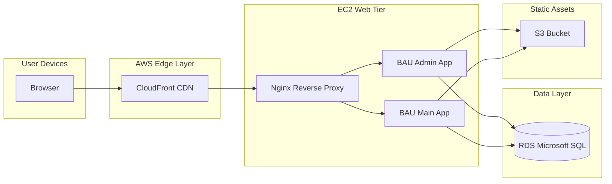

This diagram illustrates the high-level architecture of the BAU platform, showing how user devices interact with the web tier, which in turn communicates with the data layer and static asset storage.

---

# 🚀 Diagram 2 - Deployment Pipeline (GitHub -> AWS -> EC2)

```mermaid
flowchart LR
    subgraph Dev["Developer Workflow"]
        A[Git Commit & Push]
        B[GitHub Actions CI/CD]
    end

    subgraph Artifact["Build & Artifact Storage"]
        C[Build .NET Apps]
        D[Upload ZIP to S3 Artifact Bucket]
    end

    subgraph Deploy["AWS CodeDeploy"]
        E[CodeDeploy Deployment Group]
        F[AppSpec.yml Lifecycle Hooks]
    end

    subgraph EC2["EC2 Instance"]
        G[Stop Existing Services]
        H[Extract New Release]
        I[Start Services]
        J[Nginx Serves Admin/Main]
    end

    A --> B
    B --> C
    C --> D
    D --> E
    E --> F
    F --> G
    G --> H
    H --> I
    I --> J
```

This diagram illustrates the deployment pipeline from code commit in GitHub to deployment on AWS EC2 instances using GitHub Actions and AWS CodeDeploy.

---

# 🛰️ Diagram 3 - Network Topology (VPC, Subnets, Routing)

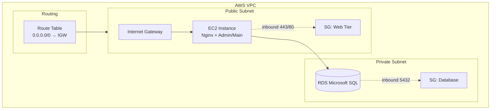

This diagram illustrates the network topology of the BAU platform within an AWS VPC, showing public and private subnets, security groups, and routing configurations.

---

# 🔗 Diagram 4 - Service Dependency Graph

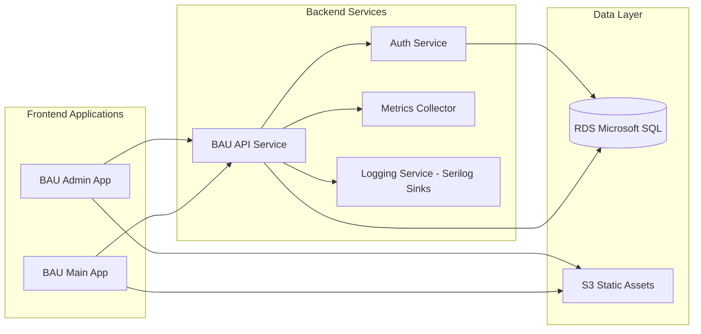

This diagram illustrates the service dependencies within the BAU platform, showing how frontend applications interact with backend services and the data layer.

---

# 🗄️ Diagram 5 - Database Schema (ERD-Style Mermaid)

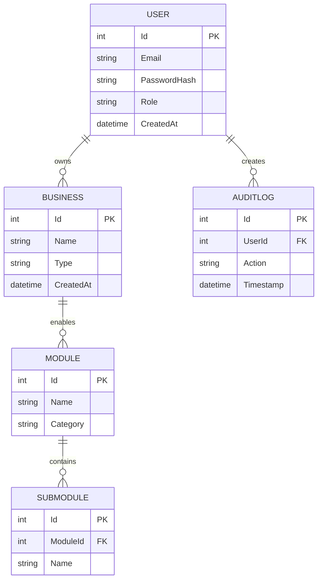

This diagram illustrates the core database schema of the BAU platform, showing entities such as User, Business, Module, Submodule, and AuditLog, along with their relationships.

---

# 🔐 Diagram 6 - User Login Sequence Flow

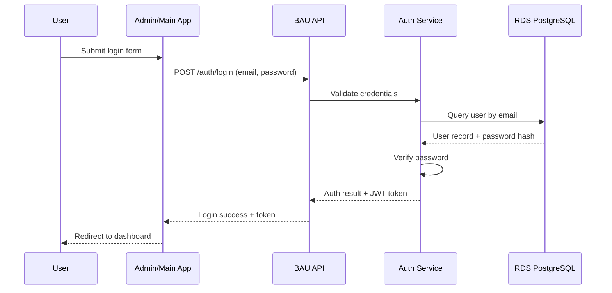

This diagram illustrates the sequence flow of a user login process in the BAU platform, showing interactions between the user, frontend app, API service, authentication service, and database.

---

# 🧩 Diagram 7 - Tech Stack Grid

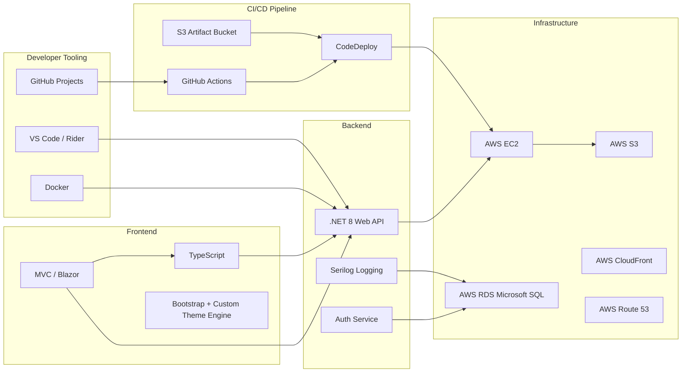

This diagram illustrates the technology stack used in the BAU platform, categorizing components into frontend, backend, infrastructure, deployment, and developer tooling.

---

# 🌐 Diagram 8 - Nginx Reverse Proxy Routing

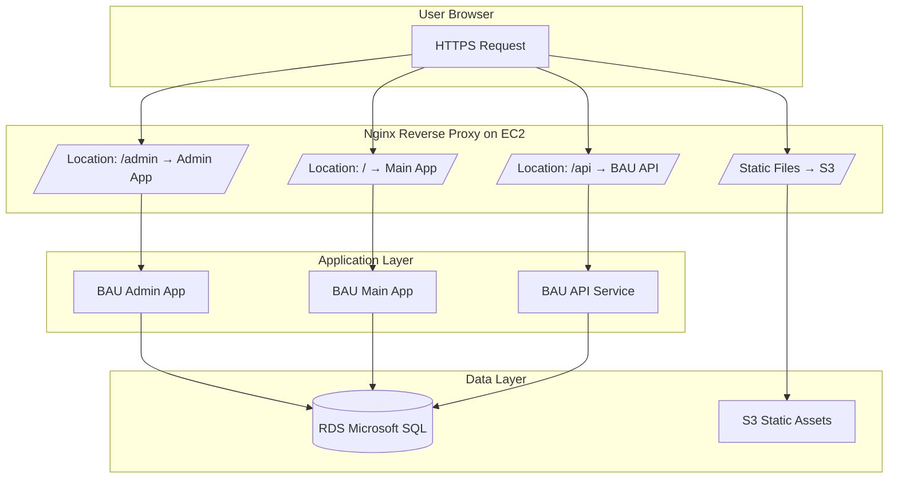

This diagram illustrates how Nginx acts as a reverse proxy in the BAU platform, routing requests to the appropriate frontend applications and API service while serving static files from S3.

---

# 📊 Diagram 9 - System Metric Pipeline (Collectors -> API -> Dashboard)

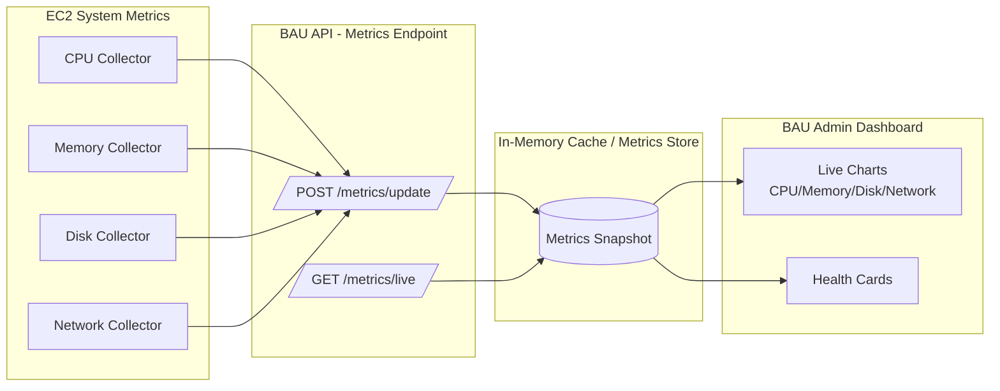

This diagram illustrates the system metric pipeline in the BAU platform, showing how system metrics are collected, sent to the API, stored, and displayed on the admin dashboard.

---

# 🧭 Diagram 10 - Provisioning Wizard Flow (Business Creation + Module Setup)

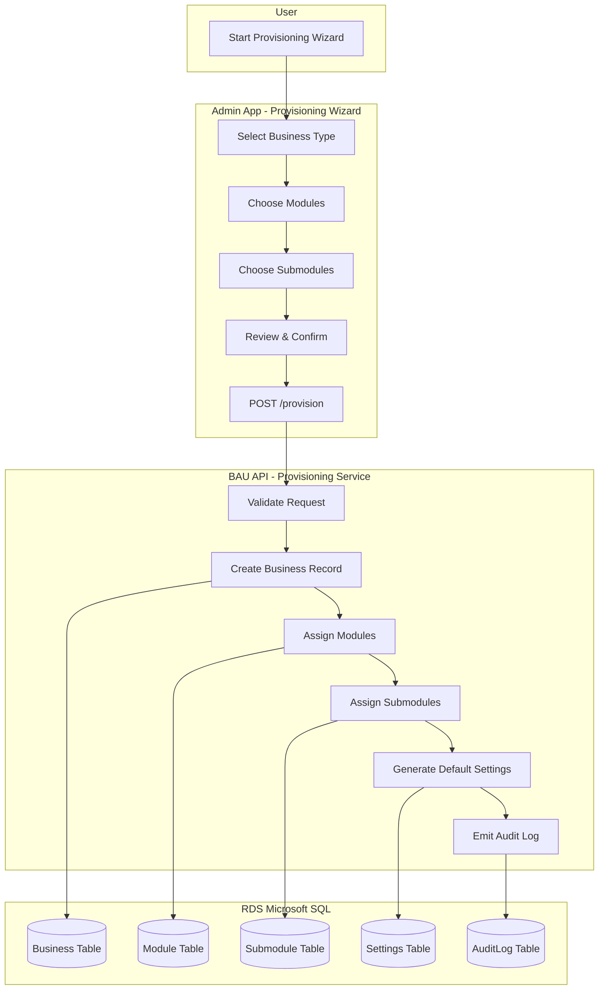

This diagram illustrates the provisioning wizard flow in the BAU platform, showing how a user interacts with the admin app to create a business and set up modules, and how the API processes the request and updates the database.

---

# 🗺️ Diagram 11 - API Routing Map (Domain-Organized Endpoints)

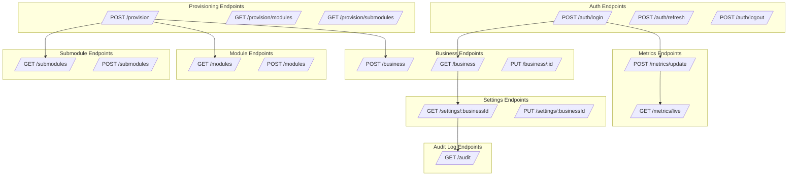

This diagram illustrates the API routing map of the BAU platform, organizing endpoints by domain and showing their relationships.

---

# 🎨 Diagram 12 - Multi-Tenant Theme Engine Architecture

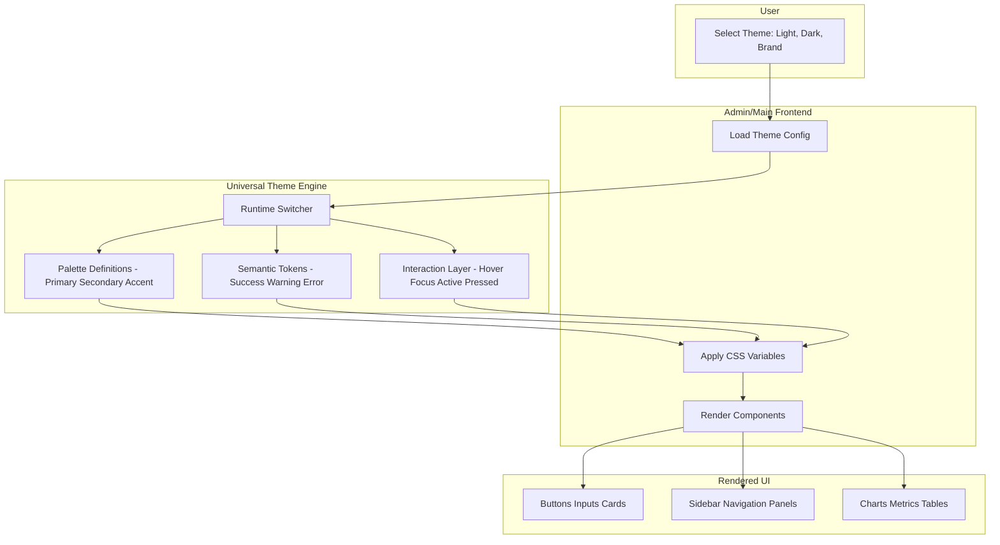

This diagram illustrates the architecture of the multi-tenant theme engine in the BAU platform, showing how user-selected themes are applied to frontend components through a universal theme engine.

---

# 🧱 Diagram 13 - Admin Dashboard Layout Architecture

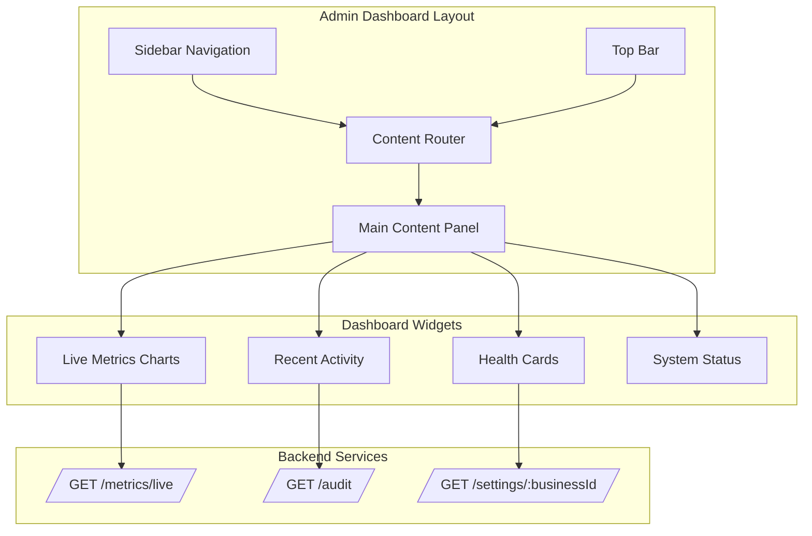

This diagram illustrates the architecture of the admin dashboard layout in the BAU platform, showing how the layout components interact with backend services to display various widgets.

---

# 🪵 Diagram 14 - Logging & Diagnostics Pipeline

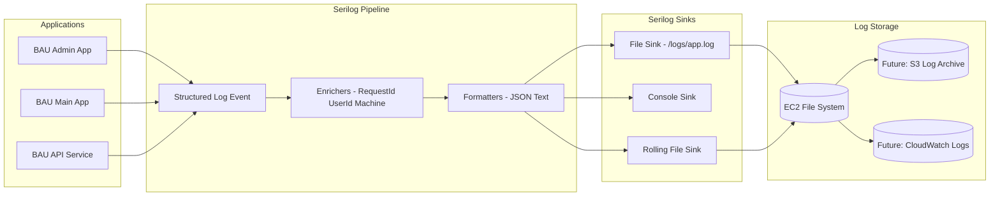

This diagram illustrates the logging and diagnostics pipeline in the BAU platform, showing how applications generate structured log events that are processed through Serilog and stored for analysis.

---

# ⚙️ Diagram 15 - Configuration & Settings Flow

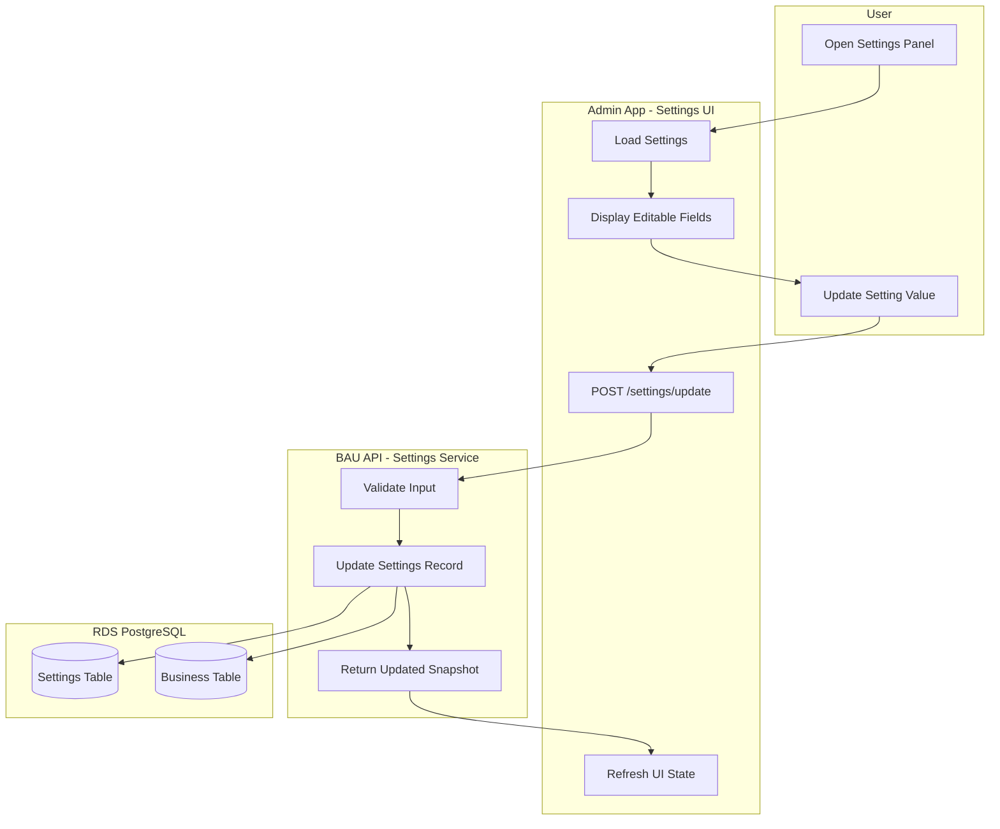

This diagram illustrates the configuration and settings flow in the BAU platform, showing how users interact with the settings UI, how the API processes updates, and how changes are stored in the database.

---

# 🔑 Diagram 16 - Authentication Token Lifecycle

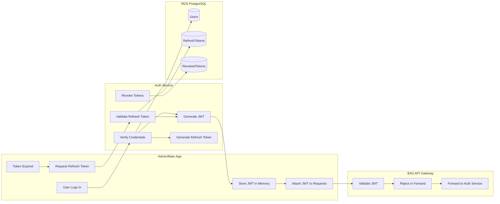

This diagram illustrates the authentication token lifecycle in the BAU platform, showing how users log in, how JWTs are managed, and how tokens are refreshed and revoked through the API and Auth Service.

---

# 📦 Diagram 17 - Static Assets Delivery Pipeline

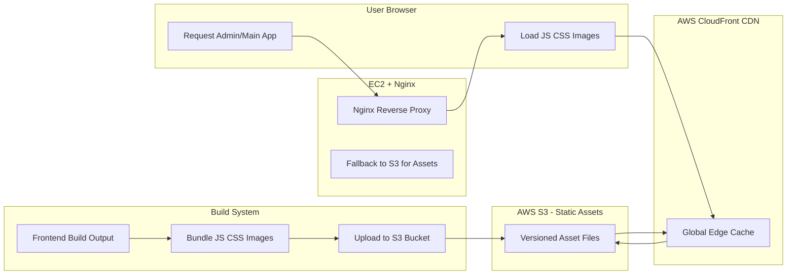

This diagram illustrates the static assets delivery pipeline in the BAU platform, showing how frontend assets are built, stored in S3, cached in CloudFront, and served to users via Nginx.

---

# 🚀 Diagram 18 - Full Deployment Pipeline (GitHub -> AWS -> EC2 -> Nginx)

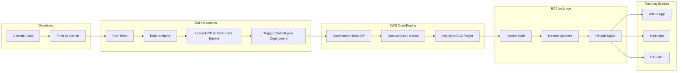

This diagram illustrates the full deployment pipeline of the BAU platform, showing the flow from code commit in GitHub through CI/CD processes to deployment on AWS EC2 instances and service restarts.

---

# 🛠️ Diagram 19 - Error Handling & Recovery Flow

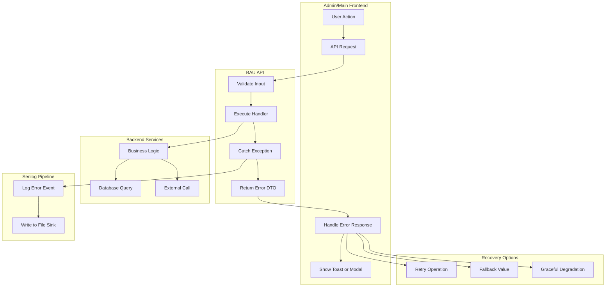

This diagram illustrates the error handling and recovery flow in the BAU platform, showing how errors are propagated from user actions through the API and backend services, logged, and handled gracefully in the frontend.

---

# 🧩 Diagram 20 - Module & Submodule Heirarchy (ERP Structure)

```mermaid
flowchart TB

    subgraph BusinessTypes["Business Types"]
        A[Retail]
        B[Manufacturing]
        C[Logistics]
        D[Healthcare]
        E[Hospitality]
        F[Professional Services]
    end

    subgraph Modules["Core Modules"]
        M1[Inventory]
        M2[Sales]
        M3[Purchasing]
        M4[HR]
        M5[Finance]
        M6[Operations]
    end

    subgraph Submodules["Submodules"]
        S1[Inventory - Items]
        S2[Inventory - Stock Levels]
        S3[Sales - Orders]
        S4[Sales - Customers]
        S5[Purchasing - Vendors]
        S6[Purchasing - PO Management]
        S7[HR - Employees]
        S8[HR - Time Tracking]
        S9[Finance - Invoices]
        S10[Finance - Payments]
        S11[Operations - Workflows]
        S12[Operations - Schedules]
    end

    A --> M1
    A --> M2
    A --> M3

    B --> M1
    B --> M3
    B --> M6

    C --> M2
    C --> M6

    D --> M4
    D --> M5

    E --> M2
    E --> M4

    F --> M2
    F --> M5

    M1 --> S1
    M1 --> S2

    M2 --> S3
    M2 --> S4

    M3 --> S5
    M3 --> S6

    M4 --> S7
    M4 --> S8

    M5 --> S9
    M5 --> S10

    M6 --> S11
    M6 --> S12
```

This diagram illustrates the module and submodule hierarchy in the BAU platform, showing how different business types relate to core modules and their respective submodules.

---

# 🌐 Diagram 21 - Full System Overview (All Components)

```mermaid
flowchart TB

    subgraph Client["User Devices"]
        C1[Browser - Admin]
        C2[Browser - Main]
    end

    subgraph Frontend["Frontend Layer"]
        F1[Admin App - MVC]
        F2[Main App - Blazor]
        F3[Theme Engine]
    end

    subgraph Nginx["EC2 - Nginx Reverse Proxy"]
        N1[/Route: /admin → Admin App/]
        N2[/Route: / → Main App/]
        N3[/Route: /api → BAU API/]
        N4[/Static Assets → S3/]
    end

    subgraph API["Backend API Layer"]
        A1[BAU API Service]
        A2[Auth Service]
        A3[Metrics Endpoint]
        A4[Provisioning Service]
    end

    subgraph Services["Internal Services"]
        S1[Metrics Collectors]
        S2[Serilog Logging]
        S3[Settings Manager]
    end

    subgraph Data["Data Layer"]
        D1[(RDS Microsoft SQL)]
        D2[(S3 Static Assets)]
        D3[(Logs on EC2)]
    end

    subgraph Deployment["CI/CD Pipeline"]
        P1[GitHub Actions]
        P2[S3 Artifact Bucket]
        P3[CodeDeploy]
    end

    C1 --> F1
    C2 --> F2

    F1 --> N1
    F2 --> N2
    F1 --> N4
    F2 --> N4

    N3 --> A1

    A1 --> A2
    A1 --> A3
    A1 --> A4

    A3 --> S1
    A1 --> S2
    A1 --> S3

    A1 --> D1
    A2 --> D1
    A4 --> D1

    N4 --> D2
    S2 --> D3

    P1 --> P2
    P2 --> P3
    P3 --> Nginx
```

This diagram illustrates the full system overview of the BAU platform, showing all major components from user devices through frontend and backend layers to data storage and deployment pipelines.

---

# 📱 Diagram 22 - Future Mobile Architecture (Android & iOS)

```mermaid
flowchart LR

    subgraph Mobile["BAU Mobile Apps"]
        M1[Android App]
        M2[iOS App]
        M3[Shared Theme Engine]
        M4[Local Storage - Secure]
    end

    subgraph Gateway["API Gateway Layer"]
        G1[/Route: /api → BAU API/]
        G2[/Auth Token Validation/]
    end

    subgraph API["Backend Services"]
        A1[BAU API Service]
        A2[Auth Service]
        A3[Settings Service]
        A4[Metrics Service]
    end

    subgraph Data["Data Layer"]
        D1[(RDS Microsoft SQL)]
        D2[(S3 Assets)]
    end

    subgraph Push["Notifications"]
        P1[AWS SNS - Mobile Push]
    end

    M1 --> G1
    M2 --> G1

    M1 --> M3
    M2 --> M3

    M1 --> M4
    M2 --> M4

    G1 --> A1
    G2 --> A2

    A1 --> D1
    A2 --> D1
    A3 --> D1

    A1 --> D2

    A1 --> P1
    P1 --> M1
    P1 --> M2
```

This diagram illustrates the future mobile architecture for the BAU platform, showing how Android and iOS apps interact with the API gateway, backend services, data layer, and push notification system.

---

# 📱 Diagram 23 - Mobile Navigation Flow (Android & iOS)

```mermaid
flowchart TB

    subgraph App["BAU Mobile App"]
        A[Launch App]
        B[Check Auth State]
        C[Login Screen]
        D[Dashboard]
        E[Module List]
        F[Module Detail]
        G[Settings]
    end

    subgraph API["BAU API"]
        H[Validate Token]
        I[Fetch Modules]
        J[Fetch Module Data]
    end

    A --> B
    B -->|Token Valid| D
    B -->|No Token| C
    C --> H
    D --> E
    E --> I
    E --> F
    F --> J
    D --> G
```

This diagram illustrates the mobile navigation flow for the BAU platform, showing how users navigate through the app and how the app interacts with the backend API for authentication and data retrieval.

---

# 🔄 Diagram 24 - Offline Sync Architecture

```mermaid
flowchart LR

    subgraph Mobile["Mobile App"]
        A[Local Database]
        B[Sync Queue]
        C[Pending Changes]
        D[Conflict Resolver]
    end

    subgraph Sync["Sync Engine"]
        E[Detect Changes]
        F[Batch Requests]
        G[Retry Logic]
    end

    subgraph API["BAU API"]
        H[Apply Changes]
        I[Return Updated Snapshot]
    end

    subgraph Cloud["Cloud Storage"]
        J[(RDS PostgreSQL)]
    end

    A --> B
    B --> C
    C --> E
    E --> F
    F --> G
    G --> H
    H --> J
    H --> I
    I --> A
    I --> D
```

This diagram illustrates the offline sync architecture for the BAU mobile app, showing how local changes are detected, batched, and synchronized with the backend API while handling conflicts and retries.

---

# Diagram 25 - Database Schema (High-Level ERD)

```mermaid
flowchart TB

    subgraph Business["Business Entities"]
        B1[(Business)]
        B2[(Settings)]
        B3[(Modules)]
        B4[(Submodules)]
    end

    subgraph Users["User Entities"]
        U1[(Users)]
        U2[(RefreshTokens)]
    end

    subgraph Logs["Logging Entities"]
        L1[(AuditLog)]
        L2[(ErrorLog)]
    end

    B1 --> B2
    B1 --> B3
    B3 --> B4

    U1 --> U2

    B1 --> L1
    B1 --> L2
```

This diagram illustrates a high-level database schema for the BAU platform, showing key entities such as Business, Settings, Modules, Submodules, Users, RefreshTokens, AuditLog, and ErrorLog, along with their relationships.

---

# Service Catalog

## 🛰️ Platform Services

Foundational, system‑level services required by all tenants and modules.

---

<details><summary><strong>User Management</strong> - Platform</summary>

### Purpose

Handles users, roles, and permissions across the entire BAU platform.

### Submodules

- Users
- Roles
- Permissions

### Service Type

Core Platform Service

### Dependencies

None (other modules depend on this)

---

</details>

<details><summary><strong>Audit Logs</strong> - Platform</summary>

### Purpose

Captures system and security events for compliance, diagnostics, and analytics.

### Submodules

- System Events
- Security Events

### Service Type

Core Platform Service

---

</details>

<details><summary><strong>Notifications</strong> - Platform</summary>

### Purpose

Centralized service for sending notifications across channels (email, SMS, push).

### Submodules

- Email
- SMS
- Push Notifications

### Service Type

Infrastructure Service

---

</details>

<details><summary><strong>Reporting & Analytics</strong> - Platform</summary>

### Purpose

Dashboards, exports, KPIs, and analytics pipelines.

### Submodules

- Dashboards
- Exports
- KPIs

### Service Type

Platform Service

---

</details>

<details><summary><strong>Integrations</strong> - Platform</summary>

### Purpose

External system integrations, API keys, webhooks, and connectors.

### Submodules

- API Keys
- Webhooks
- Connectors

### Service Type

Platform Service

---

</details>

<details><summary><strong>System Settings</strong> - Platform</summary>

### Purpose

Global and tenant-level configuration.

### Submodules

- Company Profile
- Preferences

### Service Type

Platform Service

---

</details>

<details><summary><strong>Localization</strong> - Platform</summary>

### Purpose

Languages, regions, and localization rules.

### Submodules

- Languages
- Regions

### Service Type

Platform Service

---

</details>

## 💰 Financial Services

<details><summary><strong>Accounting</strong> - Financial</summary>

### Purpose

Core accounting engine for journal entries and chart of accounts.

### Submodules

- Chart of Accounts
- Journal Entries

### Service Type

Domain Module

---

</details>

<details><summary><strong>General Ledger</strong> - Financial</summary>

### Purpose

Ledger management and reconciliation workflows.

### Submodules

- Ledgers
- Reconciliation

### Service Type

Domain Module

---

</details>

<details><summary><strong>Accounts Receivable</strong> - Financial</summary>

### Purpose

Invoice management and collections.

### Submodules

- Invoices
- Collections

### Service Type

Domain Module

---

</details>

<details><summary><strong>Accounts Payable</strong> - Financial</summary>

### Purpose

Vender bills ans payments.

### Submodules

- Bills
- Vendor Payments

### Service Type

Domain Module

---

</details>

<details><summary><strong>Billing</strong> - Financial</summary>

### Purpose

Recurring and one-time billing engine.

### Submodules

- Recurring Billing
- One-Time Billing

### Service Type

Domain Module

---

</details>

<details><summary><strong>Invoicing</strong> - Financial</summary>

### Purpose

Invoice templates and delivery.

### Submodules

- Templates
- Delivery

### Service Type

Domain Module

---

</details>

<details><summary><strong>Payments</strong> - Financial</summary>

### Purpose

Payment gateways and reconciliation.

### Submodules

- Gateways
- Reconciliation

### Service Type

Domain Module

---

</details>

<details><summary><strong>Payroll</strong> - Financial</summary>

### Purpose

Pay runs and deductions.

### Submodules

- Pay Runs
- Deductions

### Service Type

Domain Module

### Dependencies

- Timekeeping (HR)

---

</details>

<details><summary><strong>Banking</strong> - Financial</summary>

### Purpose

Bank accounts and transactions.

### Submodules

- Accounts
- Transactions

### Service Type

Domain Module

---

</details>

<details><summary><strong>Budgeting</strong> - Financial</summary>

### Purpose

Forecasting and budget allocations.

### Submodules

- Forecasts
- Allocations

### Service Type

Domain Module

---

</details>

<details><summary><strong>Taxation</strong> - Financial</summary>

### Purpose

Tax rates and filings.

### Submodules

- Rates
- Filings

### Service Type

Domain Module

---

</details>

## 🧲 Sales & CRM Services

<details><summary><strong>CRM</strong> - Sales</summary>

### Purpose

Lead and opportunity management.

### Submodules

- Leads
- Opportunities

### Service Type

Domain Module

---

</details>

<details><summary><strong>Customers</strong> - Sales</summary>

### Purpose

Customer profiles and history.

### Submodules

- Profiles
- History

### Service Type

Domain Module

---

</details>

<details><summary><strong>Quotes & Estimates</strong> - Sales</summary>

### Purpose

Quote drafting and approval workflows.

### Submodules

- Drafts
- Approvals

### Service Type

Domain Module

---

</details>

<details><summary><strong>Orders</strong> - Sales</summary>

### Purpose

Sales orders and fulfillment.

### Submodules

- Sales Orders
- Fulfillment

### Service Type

Domain Module

---

</details>

<details><summary><strong>Subscriptions</strong> - Sales</summary>

### Purpose

Subscription plans and renewals.

### Submodules

- Plans
- Renewals

### Service Type

Domain Module

---

</details>

<details><summary><strong>Point of Sale (POS)</strong> - Sales</summary>

### Purpose

Registers and receipts for retail operations.

### Submodules

- Registers
- Receipts

### Service Type

Domain Module

---

</details>

<details><summary><strong>Products</strong> - Sales</summary>

### Purpose

Product catalog and variants.

### Submodules

- Catalog
- Variants

### Service Type

Domain Module

---

</details>

<details><summary><strong>Menu Management</strong> - Sales</summary>

### Purpose

Restaurant menu items and categories.

### Submodules

- Items
- Categories

### Service Type

Industry-Specific Module (Hospitality)

---

</details>

<details><summary><strong>Customer Portal</strong> - Sales</summary>

### Purpose

Self-service customer portal.

### Submodules

- Access
- Self Service

### Service Type

Domain Module

---

</details>

## ⚙️ Operations Services

<details><summary><strong>Inventory</strong> - Operations</summary>

### Purpose

Tracks stock levels, adjustments, and item availability across locations.

### Submodules

- Stock Levels
- Adjustments

### Service Type

Domain Module

---

</details>

<details><summary><strong>Warehousing</strong> - Operations</summary>

### Purpose

Bin management, warehouse transfers, and storage operations.

### Submodules

- Bins
- Transfers

### Service Type

Domain Module

---

</details>

<details><summary><strong>Purchasing</strong> - Operations</summary>

### Purpose

Purchase orders and receiving workflows.

### Submodules

- Purchase Orders
- Receipts

### Service Type

Domain Module

---

</details>

<details><summary><strong>Procurement</strong> - Operations</summary>

### Purpose

Vendor management and contract lifecycle.

### Submodules

- Vendors
- Contracts

### Service Type

Domain Module

---

</details>

<details><summary><strong>Suppliers</strong> - Operations</summary>

### Purpose

Supplier profiles and performance ratings.

### Submodules

- Profiles
- Ratings

### Service Type

Domain Module

---

</details>

<details><summary><strong>Equipment</strong> - Operations</summary>

### Purpose

Asset tracking and maintenance schedules.

### Submodules

- Assets
- Maintenance

### Service Type

Domain Module

---

</details>

<details><summary><strong>Maintenance</strong> - Operations</summary>

### Purpose

Maintenance schedules and work orders.

### Submodules

- Schedules
- Work Orders

### Service Type

Domain Module

---

</details>

<details><summary><strong>Vehicles</strong> - Operations</summary>

### Purpose

Fleet management and vehicle maintenance.

### Submodules

- Fleet
- Maintenance

### Service Type

Domain Module

---

</details>

<details><summary><strong>Fleet Management</strong> - Operations</summary>

### Purpose

Dispatching and vehicle tracking.

### Submodules

- Dispatch
- Tracking

### Service Type

Domain Module

---

</details>

<details><summary><strong>Logistics</strong> - Operations</summary>

### Purpose

Shipment management and carrier coordination.

### Submodules

- Shipments
- Carriers

### Service Type

Domain Module

---

</details>

<details><summary><strong>Routing</strong> - Operations</summary>

### Purpose

Route planning and optimization.

### Submodules

- Routes
- Optimization

### Service Type

Domain Module

---

</details>

<details><summary><strong>Scheduling</strong> - Operations</summary>

### Purpose

Calendars, assignments, and resource scheduling.

### Submodules

- Calendar
- Assignments

### Service Type

Domain Module

---

</details>

<details><summary><strong>Projects</strong> - Operations</summary>

### Purpose

Project phases, milestones, and progress tracking.

### Submodules

- Phases
- Milestones

### Service Type

Domain Module

---

</details>

<details><summary><strong>Tasks</strong> - Operations</summary>

### Purpose

Task boards and assignment workflows.

### Submodules

- Boards
- Assignments

### Service Type

Domain Module

---

</details>

<details><summary><strong>Jobs (Work Orders)</strong> - Operations</summary>

### Purpose

Job dispatching and completion workflows.

### Submodules

- Dispatch
- Completion

### Service Type

Domain Module

---

</details>

<details><summary><strong>Services</strong> - Operations</summary>

### Purpose

Service catalog and pricing.

### Submodules

- Catalog
- Pricing

### Service Type

Domain Module

---

</details>

<details><summary><strong>Workflows</strong> - Operations</summary>

### Purpose

Automation rules and triggers.

### Submodules

- Automation
- Triggers

### Service Type

Platform-Adjacent Domain Module

---

</details>

<details><summary><strong>Replenishment</strong> - Operations</summary>

### Purpose

Replenishment rules and forecasting.

### Submodules

- Rules
- Forecasting

### Service Type

Domain Module

---

</details>

<details><summary><strong>Forecasting</strong> - Operations</summary>

### Purpose

Demand and supply forecasting.

### Submodules

- Demand
- Supply

### Service Type

Domain Module

---

</details>

<details><summary><strong>Quality Control</strong> - Operations</summary>

### Purpose

Inspections and non-conformance tracking.

### Submodules

- Inspections
- Non-Conformance

### Service Type

Domain Module

---

</details>

<details><summary><strong>Compliance</strong> - Operations</summary>

### Purpose

Policies and audit workflows.

### Submodules

- Policies
- Audits

### Service Type

Domain Module

---

</details>

<details><summary><strong>Asset Management</strong> - Operations</summary>

### Purpose

Asset tracking and depreciation.

### Submodules

- Tracking
- Depreciation

### Service Type

Domain Module

---

</details>

## 👥 HR & People Services

<details><summary><strong>Human Resources</strong> - HR</summary>

### Purpose

Employee records and benefits.

### Submodules

- Employee Records
- Benefits

### Service Type

Domain Module

---

</details>

<details><summary><strong>Staff Management</strong> - HR</summary>

### Purpose

Staff profiles and role assignments.

### Submodules

- Profiles
- Roles

### Service Type

Domain Module

---

</details>

<details><summary><strong>Recruiting</strong> - HR</summary>

### Purpose

Applicant tracking and interview workflows.

### Submodules

- Applicants
- Interviews

### Service Type

Domain Module

---

</details>

<details><summary><strong>Onboarding</strong> - HR</summary>

### Purpose

Employee onboarding checklists and training.

### Submodules

- Checklists
- Training

### Service Type

Domain Module

---

</details>

<details><summary><strong>Performance</strong> - HR</summary>

### Purpose

Performance reviews and goal tracking.

### Submodules

- Reviews
- Goals

### Service Type

Domain Module

---

</details>

<details><summary><strong>Training</strong> - HR</summary>

### Purpose

Courses and certifications.

### Submodules

- Courses
- Certifications

### Service Type

Domain Module

---

</details>

<details><summary><strong>Timekeeping</strong> - HR</summary>

### Purpose

Timesheets, approvals, and shift management.

### Submodules

- Timesheets
- Approvals

### Service Type

Domain Module

### Dependencies

- Employees
- Projects
- Payroll (consumer)

---

</details>

## 📄 Documents & Communication Services

<details><summary><strong>Document Management</strong> - Documents</summary>

### Purpose

Document storage and sharing.

### Submodules

- Storage
- Sharing

### Service Type

Domain Module

---

</details>

<details><summary><strong>Messaging</strong> - Communication</summary>

### Purpose

Conversations and channels for internal communication.

### Submodules

- Conversations
- Channels

### Service Type

Domain Module

---

</details>

<details><summary><strong>Knowledge Base</strong> - Documents</summary>

### Purpose

Articles and categorized knowledge content.

### Submodules

- Articles
- Categories

### Service Type

Domain Module

---

</details>

<details><summary><strong>File Storage</strong> - Documents</summary>

### Purpose

File uploads and folder organization.

### Submodules

- Uploads
- Folders

### Service Type

Infrastructure-Adjacent Module

---

</details>

## 🏭 Industry-Specific Services

<details><summary><strong>Patients</strong> - Healthcare</summary>

### Purpose

Patient records and visit tracking.

### Submodules

- Records
- Visits

### Service Type

Industry-Specific Module

---

</details>

<details><summary><strong>Clinical Notes</strong> - Healthcare</summary>

### Purpose

SOAP notes and charting.

### Submodules

- SOAP Notes
- Charts

### Service Type

Industry-Specific Module

---

</details>

<details><summary><strong>Reservations</strong> - Hospitality</summary>

### Purpose

Bookings and calendar management.

### Submodules

- Bookings
- Calendar

### Service Type

Industry-Specific Module

---

</details>

<details><summary><strong>Events</strong> - Hospitality</summary>

### Purpose

Event planning and staffing.

### Submodules

- Planning
- Staffing

### Service Type

Industry-Specific Module

---

</details>

<details><summary><strong>Safety</strong> - Mining</summary>

### Purpose

Incident tracking and safety training.

### Submodules

- Incidents
- Training

### Service Type

Industry-Specific Module

---

</details>

<details><summary><strong>Dispatch</strong> - Logistics</summary>

### Purpose

Assignments and tracking for field operations.

### Submodules

- Assignments
- Tracking

### Service Type

Industry-Specific Module

---

</details>

<details><summary><strong>Contracts</strong> - Professional Services</summary>

### Purpose

Contract templates and approvals.

### Submodules

- Templates
- Approvals

### Service Type

Industry-Specific Module

---

</details>

<details><summary><strong>Field Service</strong> - Professional Services</summary>

### Purpose

Field visits ans reporting.

### Submodules

- Visits
- Reports

### Service Type

Industry-Specific Module

---

</details>

---

# Event Catalog

The BAU ecosystem uses and <strong>event-driven architecture</strong> to keep microservices decoupled, scalable, and independently deployable.

This catalog defines:

- Event names
- Producers
- Consumers
- Payload schema
- Versioning
- Purpose

Every event is:

- Immutable
- Versioned
- Tenant-aware
- JSON-structured
- Published asyncronously

---

## 📡 Event Categories

Events are grouped into the following domains:

- Platform Events
- Financial Events
- Sales & CRM Events
- Operations Events
- HR & People Events
- Documents & Communication Events
- Industry-Specific Events

Each event is presented in a collapsible block for clarity.

___

## 🛰️ Platform Events

<details><summary><strong>Tenant.Created</strong> - Provisioning Service</summary>

### Purpose

Emitted when a new tenant is provisioned and their databases are created.

### Producer

- Provisioning Engine

### Consumers

- Identity
- Notifications
- Settings
- Any module that needs tenant bootstrap logic

### Payload

```Json
{
  "eventId": "uuid",
  "timestamp": "ISO-8601",
  "tenantId": "string",
  "tenantName": "string",
  "createdBy": "userId"
}
```

### Version

v1

---

</details>

<details><summary><strong>User.Created</strong> - User Management</summary>

### Purpose

A new user account has been created.

### Producer

- User Management

### Consumers

- Notifications
- Audit Logs
- HR (optional)

### Payload

```Json
{
  "eventId": "uuid",
  "timestamp": "ISO-8601",
  "tenantId": "string",
  "userId": "string",
  "email": "string",
  "roles": ["string"]
}
```

### Version

v1

---

</details>

<details><summary><strong>User.RoleUpdated</strong> - User Management</summary>

### Purpose

User roles or permissions have changed.

### Producer

- User Management

### Consumers

- Audit Logs
- Any module with role-based capabilities

### Payload

```Json
{
  "eventId": "uuid",
  "timestamp": "ISO-8601",
  "tenantId": "string",
  "userId": "string",
  "roles": ["string"]
}
```

### Version

v1

---

</details>

<details><summary><strong>Notification.Delivered</strong> - Notifications</summary>

### Purpose

Confirms that an email/SMS/push notification was delivered.

### Producer

- Notifications

### Consumers

- Audit Logs
- Reporting

### Payload

```Json
{
  "eventId": "uuid",
  "timestamp": "ISO-8601",
  "tenantId": "string",
  "notificationId": "string",
  "channel": "email|sms|push",
  "status": "delivered"
}
```

### Version

v1

---

</details>

## 💰 Financial Events

<details><summary><strong>Invoice.Created</strong> - Invoicing</summary>

### Purpose

A new invoice has been generated.

### Producer

- Accounts Receivable

### Consumers

- Accounting
- General Ledger
- Notifications
- Reporting

### Payload

```Json
{
  "eventId": "uuid",
  "timestamp": "ISO-8601",
  "tenantId": "string",
  "invoiceId": "string",
  "customerId": "string",
  "amount": "decimal",
  "dueDate": "ISO-8601"
}
```

### Version

v1

---

</details>

<details><summary><strong>Payment.Received</strong> - Payments</summary>

### Purpose

A customer payment has been successfully processed.

### Producer

- Payments

### Consumers

- Accounts Receivable
- Accounting
- Notifications
- Reporting

### Payload

```Json
{
  "eventId": "uuid",
  "timestamp": "ISO-8601",
  "tenantId": "string",
  "paymentId": "string",
  "invoiceId": "string",
  "amount": "decimal",
  "method": "string"
}
```

### Version

v1

---

</details>

<details><summary><strong>PayRun.Completed</strong> - Payroll</summary>

### Purpose

A payroll run has been completed.

### Producer

- Payroll

### Consumers

- Accounting
- Notifications
- Reporting

### Payload

```Json
{
  "eventId": "uuid",
  "timestamp": "ISO-8601",
  "tenantId": "string",
  "payRunId": "string",
  "totalAmount": "decimal",
  "employeeCount": "number"
}
```

### Version

v1

---

</details>

## 🧲 Sales & CRM Events

<details><summary><strong>Lead.Created</strong> - CRM</summary>

### Purpose

A new lead has entered the CRM pipeline.

### Producer

- CRM

### Consumers

- Notifications
- Reporting
- Sales Automation

### Payload

```Json
{
  "eventId": "uuid",
  "timestamp": "ISO-8601",
  "tenantId": "string",
  "leadId": "string",
  "source": "string"
}
```

### Version

v1

---

</details>

<details><summary><strong>Order.Created</strong> - Orders</summary>

### Purpose

A new sales order has been placed.

### Producer

- Orders

### Consumers

- Inventory
- Accounting
- Fulfillment
- Notifications

### Payload

```Json
{
  "eventId": "uuid",
  "timestamp": "ISO-8601",
  "tenantId": "string",
  "orderId": "string",
  "customerId": "string",
  "total": "decimal"
}
```

### Version

v1

---

</details>

<details><summary><strong>Subscription.Renewed</strong> - Subscriptions</summary>

### Purpose

A subscription has auto-renewed.

### Producer

- Subscriptions

### Consumers

- Billing
- Notifications
- Reporting

### Payload

```Json
{
  "eventId": "uuid",
  "timestamp": "ISO-8601",
  "tenantId": "string",
  "subscriptionId": "string",
  "renewalDate": "ISO-8601"
}
```

### Version

v1

---

</details>

## ⚙️ Operations Events

<details><summary><strong>Inventory.StockAdjusted</strong> - Inventory</summary>

### Purpose

Stock levels have changed due to an adjustment.

### Producer

- Inventory

### Consumers

- Reporting
- Warehousing
- Replenishment

### Payload

```Json
{
  "eventId": "uuid",
  "timestamp": "ISO-8601",
  "tenantId": "string",
  "itemId": "string",
  "delta": "number",
  "reason": "string"
}
```

### Version

v1

---

</details>

<details><summary><strong>Shipment.Created</strong> - Logistics</summary>

### Purpose

A shipment has been created.

### Producer

- Logistics

### Consumers

- Routing
- Notifications
- Reporting

### Payload

```Json
{
  "eventId": "uuid",
  "timestamp": "ISO-8601",
  "tenantId": "string",
  "shipmentId": "string",
  "carrierId": "string"
}
```

### Version

v1

---

</details>

<details><summary><strong>Project.Updated</strong> - Projects</summary>

### Purpose

A project's metadata has changed.

### Producer

- Projects

### Consumers

- Timekeeping
- Tasks
- Reporting

### Payload

```Json
{
  "eventId": "uuid",
  "timestamp": "ISO-8601",
  "tenantId": "string",
  "projectId": "string",
  "changes": {}
}
```

### Version

v1

---

</details>

## 👥 HR & People Events

<details><summary><strong>Employee.Updated</strong> - HR</summary>

### Purpose

Employee profile changes.

### Producer

- HR

### Consumers

- Timekeeping
- Payroll
- Projects
- Notifications

### Payload

```Json
{
  "eventId": "uuid",
  "timestamp": "ISO-8601",
  "tenantId": "string",
  "employeeId": "string",
  "changes": {}
}
```

### Version

v1

---

</details>

<details><summary><strong>TimeEntry.Approved</strong> - Timekeeping</summary>

### Purpose

A time entry has been approved and is ready for payroll.

### Producer

- Timekeeping

### Consumers

- Payroll
- Reporting

### Payload

```Json
{
  "eventId": "uuid",
  "timestamp": "ISO-8601",
  "tenantId": "string",
  "timeEntryId": "string",
  "employeeId": "string",
  "durationMinutes": "number"
}
```

### Version

v1

---

</details>

## 📄 Document Events

<details><summary><strong>Document.Uploaded</strong> - File Storage</summary>

### Purpose

A new document has been uploaded.

### Producer

- Documents

### Consumers

- File Storage
- Knowledge Base
- Messaging (optional)

### Payload

```Json
{
  "eventId": "uuid",
  "timestamp": "ISO-8601",
  "tenantId": "string",
  "documentId": "string",
  "uploadedBy": "string"
}
```

### Version

v1

---

</details>

## 🏭 Industry-Specific Events

<details><summary><strong>Patient.VistRecorded</strong> - Healthcare</summary>

### Purpose

A patient visit has been logged.

### Producer

- Patients

### Consumers

- Clinical Notes
- Billing
- Reporting

### Payload

```Json
{
  "eventId": "uuid",
  "timestamp": "ISO-8601",
  "tenantId": "string",
  "patientId": "string",
  "visitId": "string"
}
```

### Version

v1

---

</details>

# Deployment Topology

This section describes how the BAU microservice ecosystem is deployed across AWS infrastructure. It explains where each component runs, how traffic flows, how services scale, and how the platform maintains reliability, observability, and tenant isolation.

The goal is to give contributors a clear mental model of the <strong>runtime environment</strong> &mdash; from the public internet down to individual microservices and tenant databases.

---

## 🏗️ High-Level Overview

BAU is deployed as a <strong>multi-service, multi-tier architecture</strong> running on AWS:

- <strong>CloudFront</strong> serves static assets globally
- <strong>Nginx Reverse Proxy</strong> routes UI traffic
- <strong>API Gateway Service</strong> routes API traffic
- <strong>Microservices</strong> run on EC2 (or ECS in future evolution)
- <strong>RDS SQL Server</strong> hosts tenant-per-database storage
- <strong>S3</strong> stores static assets and artifacts
- <strong>CloudWatch</strong> handles logs, metrics, and alarms
- <strong>GitHub Actions -> S3 -> CodeDeploy</strong> handles deployments

The topology is intentionally modular, allowing each service to scale independently and maintain clear boundaries.

---

## 🛰️ Traffic Flow Overview

Client → CloudFront → Nginx → Admin/Main Apps → API Gateway → Microservices → RDS
                
1. Client
    - Browsers, mobile apps, desktop apps, and future devices.

2. CloudFront CDN
    - Serves static assets (JS, CSS, images)
    - Caches Admin/Main UI bundles
    - Reduces latency globally

3. Nginx Reverse Proxy
    - Terminates HTTPS
    - Routes UI traffic to Admin/Main apps
    - Routes API traffic to API Gateway
    - Enforces security headers
    - Provides rate limiting (optional)

4. Admin & Main Apps
    - MVC/Blazor frontends
    - Dynamically load module UIs via MRS
    - Communicate only with the API Gateway

5. API Gateway Service
    - Auth
    - Tenant Resolution
    - Routing
    - Request aggregation
    - Logging & tracing

6. Microservices <br />
    Each module runs as an independent service with:
    - Its own API
    - Its own database
    - Its own CI/CD pipeline
    - Its own scaling rules

7. RDS SQL Server
    - Tenant-per-database
    - Module-per-schema
    - Automated backups
    - Multi-AZ (optional)

---

## 🧩 Component Resolution

1. CloudFront CDN
    - Global edge caching
    - Serves static assets from D3
    - Reduces load on EC2
    - Improves performance for Admin/Main apps

    Primary Consumers:

    - Admin App
    - Main App
    - Module UI bundles

---

2. Nginx Reverse Proxy (EC2)
    - Acts as the <strong>front door</strong> for all BAU traffic:

    Responsibilities:

    - HTTPS termination
    - Routing rules
    - Reverse proxy to Admin/Main apps
    - Reverse proxy to API Gateway
    - Static asset fallback
    - Logging

    Example Routing:

    ```
    /           → Admin App
    /app        → Main App
    /api/*      → API Gateway
    /assets/*   → S3/CloudFront
    ```

---

3. Admin & Main Applications (EC2)
    - These are the <strong>shell applications</strong> that load module UIs dynamically.

    Responsibilities:

    - Authentication UI
    - Navigation
    - Module discovery via MRS
    - Loading micro-frontends
    - Tenant switching
    - User settings

    Deployment:

    - Hosted on EC2
    - Served behind Nginx
    - Built via GitHub Actions
    - Deployed via CodeDeploy

---

4. API Gateway Service (EC2)
    - The <strong>central routing brain</strong> of the platform.

    Responsibilities:

    - Validate JWT tokens
    - Resolve tenant context
    - Forward requests to microservices
    - Enforce authorization
    - Aggregate responses (optional)
    - Emit request logs & metrics

    Deployment:

    - Independent EC2 instance or autoscaling group
    - Cached module metadata from MRS
    - Health-checked by Nginx

---

5. Microservices (EC2)
    - Each BAU module is deployed as its own microservice.

    Characteristics:

    - Independent deployment
    - Independent scaling
    - Independent database
    - Independent health checks
    - Independent logs & metrics

    Deployment Model:

    - Each service runs on its own EC2 instance (or ECS task in future)
    - CodeDeploy handles rolling updates
    - CloudWatch monitors health

    Examples:

    - Timekeeping
    - Inventory
    - CRM
    - Payroll
    - Notifications
    - Projects
    - Documents
    - Etc.

---

6. RDS SQL Server
    - The backbone of BAU's <strong>tenant-per-database</strong> strategy.

    Characteristics:

    - One database per tenant per module
    - Automated backups
    - Point-in-time restore
    - Multi-AZ optional
    - Encrypted at rest

    Example:

    ```
    bau_tenantA_timekeeping
    bau_tenantA_inventory
    bau_tenantA_crm
    bau_tenantB_timekeeping
    ...
    ```

---

7. S3 Buckets
    Used for:

    - Static assets
    - UI bundles
    - Deployment artifacts
    - Document storage
    - Backups

    Buckets:

    - bau-static-assets
    - bau-artifacts
    - bau-documents

---

8. CloudWatch
    Handles:

    - Logs
    - Metrics
    - Dashboards
    - Alarms
    - Traces (via X-Ray)

    Examples:

    - API Gateway latency
    - Microservice health
    - Database connection failures
    - Tenant provisioning errors

---

9. Deployment Pipeline
    - BAU uses a <strong>GitHub Actions -> S3 -> CodeDeploy -> EC2</strong> pipeline.

    Flow:

    1. Developer pushes to GitHub
    2. GitHub Actions builds the service
    3. Artifact uploaded to S3
    4. CodeDeploy deploys to EC2
    5. Health checks run
    6. Traffic shifted to new version

    Benefits:

    - Zero downtime deployments
    - Rollback support
    - Consistent across all microservices

---

## 🗺️ Network Topology

### Public Subnet

- Nginx Reverse Proxy
- CloudFrong endpoints

### Private Subnet

- Admin/Main Apps
- API Gateway
- Microservices
- RDS SQL Server
- Internal S3 access

### Security Groups

- Strict east-west traffic rules
- Only Nginx exposed publicly
- Microservices only reachable via API Gateway

---

## 📈 Scaling Strategy

### Nginx

- Scales vertically or via load balancer

### API Gateway

- Horizontal scaling via EC2 autoscaling group

### Microservices

- Each service scales independently
- CPU/memory-based autoscaling

### RDS

- Vertical scaling
- Read replicas (optional)

---

## 🔐 Security Model

- Https everywhere
- JWT authentication
- Tenant isolation enforced at gateway + DB layer
- IAM roles for EC2 -> S3 access
- Parameter Store for secrets
- Security groups restrict lateral movement

---

# Local Development Workflow

This section defines how contributors run the BAU platform locally, including the Module Registry Service (MRS), API Gateway, microservices, Admin/Main apps, and tenant-per-database setup.

The goal is to make local development:

- Predictable
- Modular
- Fast
- Cloud-agnostic
- Contributor-friendly

Every BAU microservice follows the same local workflow, ensuring consistency across the entire ecosystem.

---

## 🧰 Local Requirements

Contributors must install:

- <strong>.NET 9 SDK</strong>
- <strong>Docker Desktop</strong>
- <strong>SQL Server Developer Edition</strong> or <strong>SQL Server in Docker</strong>
- <strong>Git</strong>
- <strong>Postman/Thunder Client</strong> (optional)

Optional but recommmended:

- <strong>Azure Data Studio</strong> or <strong>SQL Server Management Studio</strong>
- <strong>ngrok</strong> (for webhook testing)

---

## 🧱 Local Architecture Overview

Locally, BAU runs as a <strong>miniature version</strong> of the production topology:

```
Admin/Main Apps → API Gateway → Microservices → Local SQL Server
                     ↑
                     |
                 Module Registry Service (MRS)
```

All services run on localhost using:

- Docker Compose (for shared infrastructure)
- Individual `dotnet run` processes for microservices
- Local environment variables for tenant/database resolution

---

## 🐳Docker Compose (Shared Infrastructure)

A standard `docker-compose.yml` is provided to run:

- Module Registry Service (MRS)
- API Gateway
- SQL Server
- Event Bus (future: RabbitMQ / SNS/SQS localstack)
- Logging pipline (future)

### Example (simplified)

```Yaml
services:
  sqlserver:
    image: mcr.microsoft.com/mssql/server:2022-latest
    ports:
      - "1433:1433"
    environment:
      SA_PASSWORD: "Your_password123"
      ACCEPT_EULA: "Y"

  mrs:
    build: ./ModuleRegistryService
    ports:
      - "5001:80"

  gateway:
    build: ./ApiGateway
    ports:
      - "5000:80"
```

Contributors start the shared stack with:

```bash
docker-compose up -d
```

---

## 🏃 Running a Microservice Locally

Each microservice runs independently using:

```bash
dotnet run --project ./ModuleName.Api
```

On startup, the service will:

1. Load local configuration
1. Register itself with the local MRS
1. Expose its API on a local port (e.g., `http://localhost:5100`)
1. Connect to the tenant database using local connection rules

### Local Ports (Convention)

| Service Type         | Port Range   |
|----------------------|--------------|
| API Gateway          | 5000 - 5009  |
| Core Services        | 5010 - 5029  |
| Domain Modules       | 5100 - 5999  |

Each module chooses a port in its domain range.

---

## 🧭 Module Registration (Local)

When a microservice starts locally, it calls:

```Post
POST http://localhost:5001/api/modules/register
```

The payload includes:

- moduleId
- displayName
- apiBaseUrl (local)
- uiEntryPoint (optional)
- healthUrl
- capabilities

This allows the Admin/Main apps to dynamically discover modules <strong>even in local development</strong>.

---

## 🧪 Local Tenant Databases

BAU uses <strong>tenant-per-database</strong>, even locally.

### Local Naming Convention:

```
bau_local_tenant1_timekeeping
bau_local_tenant1_inventory
bau_local_tenant2_crm
```

### Provisioning Locally

Contributors run:

```Post
POST http://localhost:5000/api/provisioning/create-tenant
```

This triggers:

- Database creation
- Schema migrations
- Module bootstrap events

---

## 🧩 Running Admin & Main Apps Locally

Admin and Main apps run with:

```Powershell
dotnet run
```

### Local Behavior:

- They call the local MRS (`http://localhost:5001`)
- They dynamically load module UIs
- They route all API calls through the local API Gateway (`http://localhost:5000`)

This perfectly mirrors production behavior.

---

## 🔄 Hot Reload Workflow

### For .NET Microservices:

```Powershell
dotnet watch run
```

### For Admin/Main Apps:
```Powershell
dotnet run
```

### For Shared Infrastructure:

Docker containers restart automatically when rebuilt.

---

## 🧪 Testing Microservices Locally

Contributors can test endpoints using:

- Postman
- Thunder Client
- curl
- Swagger UI (each module exposes `/swagger`)

### Example:

```Get
GET http://localhost:5100/time-entries
```

---

## 🧵 Debugging & Logs

### Microservices

- Console logs
- Structured JSON logs
- Correlation IDs
- Tenant IDs

### API Gateway

- Request tracing
- Routing logs
- Tenant resolution logs

### MRS

- Module registration logs
- Health check logs

---

## 🧬 Local Event Bus (Future)

BAU will support:

- RabbitM!
- SNS/SQS via LocalStack
- Azure Service Bus (optional)

Local development will use:

```Powershell
docker compose up event-bus
```

Microservices will auto-connect to the local event bus.

---

## 🧹 Resetting the Local Environment

To wipe all local databases:

```Powershell
docker compose down -v
```

To rebuild everything:

```Powershell
docker compose up --build
```

