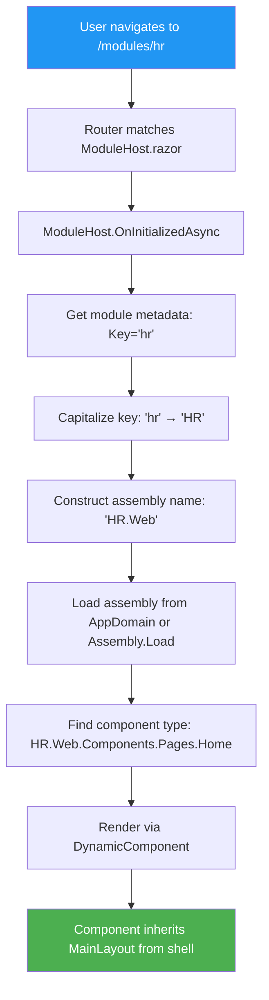

# Module Loading Fixes - Resolution Summary

## Issues Reported

1. **"Module not found"** error when navigating to HR module
2. **Layout disappears on refresh** - shell header/sidebar removed, only module content visible

## Root Causes Identified

### Issue 1: Assembly Name Case Mismatch
**Location:** `frontend/BusinessAsUsual.Web/Pages/ModuleHost.razor` line 77

**Problem:**
```csharp
var assemblyName = $"{module.Key}.Web";  // Produces "hr.Web"
```

- Module registry uses `Key = "hr"` (lowercase)
- Actual assembly name is `HR.Web` (uppercase)
- `Assembly.Load()` is case-sensitive
- Result: Assembly failed to load, component type resolution failed

**Fix Applied:**
```csharp
var assemblyName = $"{char.ToUpper(module.Key[0])}{module.Key.Substring(1)}.Web";  
// Produces "HR.Web" ✅
```

### Issue 2: HR Components Force Their Own Layout
**Location:** HR.Web component pages

**Problem:**
```razor
@page "/hr"
@layout IframeLayout  ← Forces minimal layout without shell chrome
```

- HR.Web components had `@layout IframeLayout` directives
- `IframeLayout` is minimal (no header/sidebar)
- When loaded via `DynamicComponent`, components respect their own layout directive
- Result: Shell's `MainLayout` was bypassed, only module layout rendered

**Fix Applied:**
Removed `@layout IframeLayout` directives from:
- `services/HR/HR.Web/Components/Pages/Home.razor`
- `services/HR/HR.Web/Components/Pages/Employees.razor`

Components now inherit the layout from their host (`MainLayout` from the shell).

## Additional Improvements

### Enhanced Diagnostic Logging

Added comprehensive console logging to `ModuleHost.razor`:

```csharp
Console.WriteLine($"[ModuleHost] Looking for assembly: {assemblyName}");
Console.WriteLine($"[ModuleHost] ✅ Successfully loaded assembly: {assemblyName}");
Console.WriteLine($"[ModuleHost] Looking for component: {componentFullName}");
Console.WriteLine($"[ModuleHost] Available types in assembly:");
foreach (var type in assembly.GetTypes().Where(t => t.Namespace?.Contains("Components.Pages") == true))
{
	Console.WriteLine($"  - {type.FullName}");
}
```

This will help diagnose any future component loading issues.

## Testing Instructions

**⚠️ IMPORTANT:** The application is currently running and the DLL is locked. You need to:

1. **Stop the running application**
2. **Rebuild the solution:**
   ```powershell
   dotnet build
   ```
3. **Start the application again**
4. **Test the following scenarios:**

### Test 1: Navigate to HR from Dashboard
1. Go to Dashboard (`/`)
2. Click on the HR module card
3. **Expected:** HR Home page loads with shell header/sidebar visible
4. **Check console** for logging: "✅ Successfully loaded assembly: HR.Web"

### Test 2: Direct URL Navigation
1. Navigate directly to `/modules/hr` in the browser
2. **Expected:** Shell layout (header/sidebar) renders around HR module
3. **Expected:** No "Module not found" error

### Test 3: Refresh on Module Page
1. Navigate to `/modules/hr`
2. Press F5 (refresh)
3. **Expected:** Page reloads with shell layout intact
4. **Expected:** Shell header/sidebar remain visible

### Test 4: Deep Link
1. Navigate directly to `/modules/hr/employees`
2. **Expected:** Shell layout + Employees page
3. **Expected:** Console shows "Looking for component: HR.Web.Components.Pages.Employees"

## Changed Files

1. `frontend/BusinessAsUsual.Web/Pages/ModuleHost.razor`
   - Fixed assembly name case handling
   - Added comprehensive diagnostic logging
   - Enhanced error messages

2. `services/HR/HR.Web/Components/Pages/Home.razor`
   - Removed `@layout IframeLayout` directive
   - Removed unused `@using HR.Web.Components.Layout`

3. `services/HR/HR.Web/Components/Pages/Employees.razor`
   - Removed `@layout IframeLayout` directive
   - Removed unused `@using HR.Web.Components.Layout`

## Architecture Notes

### How Module Loading Works Now



### Layout Inheritance

```
┌─────────────────────────────────────┐
│ _Host.cshtml (entry point)          │
│   └─ App.razor (Router)             │
│       └─ MainLayout (default)       │  ← Shell chrome
│           └─ RouteView               │
│               └─ ModuleHost.razor    │  ← Dynamic loader
│                   └─ DynamicComponent│
│                       └─ Home.razor  │  ← HR module (no @layout)
└─────────────────────────────────────┘
```

**Key insight:** Removing `@layout` from module components allows them to inherit the shell's layout automatically.

## Success Criteria

- ✅ HR module loads without "Module not found" error
- ✅ Shell layout (header/sidebar) visible when viewing HR pages
- ✅ Layout persists on page refresh
- ✅ Deep links to module pages work correctly
- ✅ Console logs show successful assembly and component loading

## Next Steps for Additional Modules

When creating new modules (Finance, CRM, etc.):

1. **Project reference:** Add `<ProjectReference>` from shell to module.Web project
2. **Assembly name:** Use PascalCase (e.g., `Finance.Web`, not `finance.Web`)
3. **Component pages:** Place in `Components/Pages/` folder
4. **No layout directive:** Don't use `@layout` - inherit from shell
5. **Module registry:** Register with lowercase key in `ModuleDiscoveryService`

## Troubleshooting

If you still see issues after restarting:

### Check Browser Console
- Look for `[ModuleHost]` log entries
- Verify assembly loads: "✅ Successfully loaded assembly: HR.Web"
- Check component resolution: "✅ Loaded component: HR.Web.Components.Pages.Home"

### If Assembly Not Found
- Verify project reference exists in `BusinessAsUsual.Web.csproj`
- Check assembly is built: `ls services/HR/HR.Web/bin/Debug/net9.0/HR.Web.dll`
- Rebuild the solution completely

### If Component Not Found
- Check console for "Available types in assembly" list
- Verify component namespace matches: `HR.Web.Components.Pages.{Name}`
- Ensure component file is in correct folder structure

### If Layout Still Missing
- Verify `@layout` directive is removed from component
- Check `App.razor` applies `DefaultLayout="@typeof(MainLayout)"`
- Confirm no other layout directives in `_Imports.razor`

## Clean Build Command

If issues persist, try a clean rebuild:

```powershell
# Stop the application first!
dotnet clean
dotnet build
```

---

**Status:** Ready for testing - user needs to restart application

**Date:** 2025
