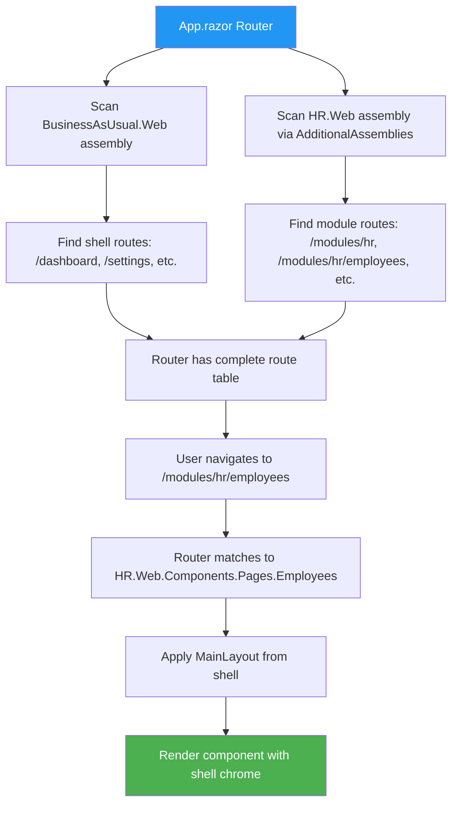

# Multi-Assembly Routing - The Real Solution

## The Problem With DynamicComponent

The previous attempt used `DynamicComponent` to load HR.Web components dynamically. This failed because:

1. **DynamicComponent just renders a single component** - it doesn't set up routing
2. **HR components have their own `@page` routes** - but the shell router didn't know about them
3. **Navigation links used hardcoded paths** - `/hr/employees` got duplicated to `/modules/hr/hr/employees`
4. **Layout conflicts** - components tried to force their own layouts

## The Real Solution: AdditionalAssemblies

Blazor's `Router` component has a built-in solution: **`AdditionalAssemblies`**

```razor
<Router AppAssembly="@typeof(Program).Assembly" 
		AdditionalAssemblies="@_additionalAssemblies">
```

This tells the router to scan additional assemblies for `@page` directives, making all routes discoverable.

## How It Works



## Implementation

### 1. Shell Router Configuration

**File:** `frontend/BusinessAsUsual.Web/App.razor`

```razor
@using System.Reflection

<Router AppAssembly="@typeof(Program).Assembly" 
		AdditionalAssemblies="@_additionalAssemblies">
	<Found Context="routeData">
		<RouteView RouteData="@routeData" DefaultLayout="@typeof(MainLayout)" />
	</Found>
	<NotFound>
		<SplashScreen />
	</NotFound>
</Router>

@code {
	private readonly Assembly[] _additionalAssemblies = new[]
	{
		typeof(HR.Web.Components.App).Assembly
	};
}
```

### 2. Module Route Prefixes

All HR.Web components use `/modules/hr` prefix:

```razor
// Home.razor
@page "/modules/hr"

// Employees.razor
@page "/modules/hr/employees"

// Counter.razor (demo)
@page "/modules/hr/counter"
```

### 3. Navigation Links

All navigation uses the `/modules/hr` prefix:

```razor
<MudButton Href="/modules/hr/employees">View Employees</MudButton>
<MudLink Href="/modules/hr">HR Home</MudLink>
```

### 4. No Layout Directives

HR components **do not** specify `@layout` - they inherit `MainLayout` from the shell automatically.

## What Was Removed

1. **ModuleHost.razor** - No longer needed; router handles everything
2. **DynamicComponent loading** - Native routing is simpler and more powerful
3. **`@layout IframeLayout`** - Components inherit shell layout
4. **Assembly name case hacks** - Not needed with proper routing

## Benefits

✅ **Native Blazor routing** - Uses framework features correctly  
✅ **No duplicate routes** - `/modules/hr/employees` works correctly  
✅ **Layout inheritance** - Shell chrome stays visible  
✅ **Refresh works** - Direct URLs load correctly  
✅ **Deep linking** - Any module URL is bookmarkable  
✅ **Simpler code** - No custom loading logic needed

## Adding New Modules

To add a new module (e.g., Finance):

### Step 1: Add Project Reference

```xml
<!-- frontend/BusinessAsUsual.Web/BusinessAsUsual.Web.csproj -->
<ProjectReference Include="..\..\services\Finance\Finance.Web\Finance.Web.csproj" />
```

### Step 2: Register Assembly in Router

```csharp
// frontend/BusinessAsUsual.Web/App.razor
private readonly Assembly[] _additionalAssemblies = new[]
{
	typeof(HR.Web.Components.App).Assembly,
	typeof(Finance.Web.Components.App).Assembly  // Add this
};
```

### Step 3: Prefix All Module Routes

```razor
// services/Finance/Finance.Web/Components/Pages/Home.razor
@page "/modules/finance"

// services/Finance/Finance.Web/Components/Pages/Invoices.razor
@page "/modules/finance/invoices"
```

### Step 4: Remove Layout Directives

```razor
// DON'T do this:
@layout SomeModuleLayout

// Components inherit shell's MainLayout automatically
```

### Step 5: Update Navigation

Module Registry should return navigation items without the `/modules/finance` prefix:

```json
{
  "key": "finance",
  "navigationItems": [
	{ "label": "Invoices", "route": "invoices" },
	{ "label": "Payroll", "route": "payroll" }
  ]
}
```

The Sidebar component constructs full URLs: `/modules/finance/invoices`

## Route Conventions

| Module | Home Route | Page Routes |
|--------|-----------|-------------|
| HR | `/modules/hr` | `/modules/hr/employees`, `/modules/hr/departments` |
| Finance | `/modules/finance` | `/modules/finance/invoices`, `/modules/finance/payroll` |
| CRM | `/modules/crm` | `/modules/crm/customers`, `/modules/crm/deals` |

**Pattern:** `/modules/{moduleKey}/{pageName}`

## Standalone vs Shell-Hosted

Modules can still run standalone if needed:

### Standalone Mode (HR.Web running on its own)

```razor
// HR.Web/Components/Pages/Home.razor
@page "/"  // Default route when standalone
@page "/modules/hr"  // Route when hosted in shell
```

### Shell-Only Mode (Recommended)

```razor
// HR.Web/Components/Pages/Home.razor
@page "/modules/hr"  // Only works when hosted
```

Simpler and avoids route conflicts.

## Troubleshooting

### Module Not Found

**Problem:** Navigating to `/modules/hr` shows 404

**Check:**
1. Is HR.Web assembly in `AdditionalAssemblies`?
2. Does component have correct `@page "/modules/hr"` directive?
3. Is project reference in shell `.csproj`?
4. Was solution rebuilt after changes?

### Duplicate Routes (/modules/hr/hr/employees)

**Problem:** Links create doubled paths

**Check:**
1. Are component `@page` directives using `/modules/hr` prefix?
2. Are `Href` attributes in navigation using full `/modules/hr/employees` paths?
3. Is sidebar constructing URLs correctly?

### Layout Missing

**Problem:** Shell header/sidebar don't show

**Check:**
1. Remove any `@layout` directives from module components
2. Verify shell `App.razor` has `DefaultLayout="@typeof(MainLayout)"`
3. Check that `MainLayout` is being applied by looking at browser dev tools

### Navigation Not Working

**Problem:** Links don't navigate or refresh breaks

**Check:**
1. Use `Href` not `@onclick` for navigation
2. Use `NavigationManager.NavigateTo()` for programmatic nav
3. Ensure routes start with `/modules/`

## Summary

**Old Approach (DynamicComponent):**
- Manual assembly loading
- Complex type resolution
- No real routing support
- Layout conflicts
- Duplicate route issues

**New Approach (AdditionalAssemblies):**
- Native Blazor feature
- Router scans assemblies automatically
- Full routing support
- Automatic layout inheritance
- Clean, predictable URLs

**Result:** Simpler code, native framework support, better maintainability.

---

**Status:** Implemented and build-successful  
**Next Step:** User rebuild and test
