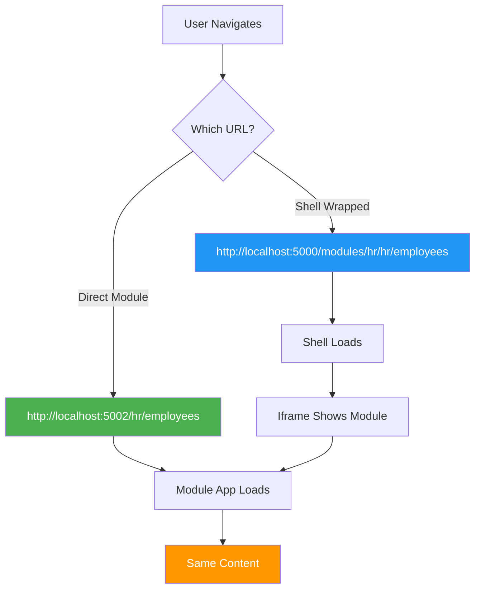

# Navigation System - Final State

## What We Did

### 1. Stripped Out Complexity
**Removed:**
- ❌ `navigation-interceptor.js` - No more click hijacking
- ❌ `NavigationInterceptorComponent.razor` - No more .NET bridge
- ❌ Standalone redirect logic - Modules can run standalone
- ❌ History API overrides - Let the browser work naturally
- ❌ postMessage gymnastics - Simplified communication

### 2. Embraced Simplicity
**Kept:**
- ✅ Module apps work standalone at their own URLs
- ✅ Shell provides optional chrome via iframe wrapper
- ✅ Theme sync (still useful for visual consistency)
- ✅ Basic message passing for parent navigation commands

## Current Architecture



## Files Changed

### Removed
1. `services/HR/HR.Web/wwwroot/js/navigation-interceptor.js`
2. `services/HR/HR.Web/Components/Layout/NavigationInterceptorComponent.razor`

### Modified
1. `services/HR/HR.Web/Components/App.razor`
   - Removed standalone redirect
   - Removed history API overrides
   - Kept simple message listener

2. `services/HR/HR.Web/Components/Layout/IframeLayout.razor`
   - Removed NavigationInterceptorComponent reference
   - Kept theme receiver

3. `services/HR/HR.Web/Components/Pages/Home.razor`
   - Changed buttons to use `Href` instead of `OnClick`
   - Removed manual navigation methods

4. `services/HR/HR.Web/Components/Pages/Employees.razor`
   - Changed breadcrumb links to use `Href`
   - Removed manual navigation methods

## Documentation Updated

### New Docs
- `docs/SIMPLE_NAVIGATION.md` - Current approach with Mermaid diagrams

### Deprecated Docs
- `docs/THE_FRIGATE.md` - Marked obsolete
- `docs/NAVIGATION_ORCHESTRATOR.md` - Marked obsolete

### Enhanced Docs
- `docs/HANDOVER_DOCUMENT.md` - Added Mermaid diagram for service structure

## How It Works Now

### Scenario 1: Direct Module Access
```
User → http://localhost:5002/hr/employees
	 → HR.Web loads standalone
	 → Shows employee list (no shell chrome)
```

### Scenario 2: Shell-Wrapped Access
```
User → http://localhost:5000/modules/hr/hr/employees
	 → Shell loads with sidebar/topbar
	 → Iframe points to: http://localhost:5002/hr/employees
	 → Shows employee list (with shell chrome)
```

### Scenario 3: Navigation Inside Module
```
User clicks link in HR module: <a href="/hr/departments">
	 → If standalone: navigates to http://localhost:5002/hr/departments
	 → If in iframe: iframe navigates to http://localhost:5002/hr/departments
	 → Parent shell URL does NOT update (and that's OK!)
```

### Scenario 4: Share a Link
```
User copies: http://localhost:5002/hr/employees?id=123
Coworker pastes in browser → Direct access, just works
```

## What We Learned

### ❌ Don't Fight the Browser
- Iframe navigation is natural behavior
- Intercepting clicks adds complexity
- History API hacks cause bugs

### ✅ Embrace Web Standards
- URLs should work standalone
- Iframes are just viewports
- Let the browser do browser things

### ✅ Progressive Enhancement
- Module works alone (core functionality)
- Shell adds chrome (enhanced experience)
- Neither depends on the other

## Next Steps

1. **Test both access modes**
   - Direct: `http://localhost:5002/hr/employees`
   - Shell: `http://localhost:5000/modules/hr/hr/employees`

2. **Verify links work**
   - Click links in module pages
   - Use breadcrumbs
   - Test sidebar navigation

3. **Check theme sync**
   - Theme changes should still propagate to iframe

4. **Document for team**
   - Share `SIMPLE_NAVIGATION.md` with developers
   - Update onboarding docs

## Success Criteria

- ✅ Module URLs work standalone
- ✅ Shell URLs wrap modules in iframe
- ✅ Links work naturally (no interception)
- ✅ Theme sync still works
- ✅ Code is simple and debuggable
- ✅ No more "navigation screwed up" issues

## Philosophy

> **"Make the simple things simple, and the complex things possible."**
> 
> We were making the simple thing (navigation) complex.
> 
> Now it's simple again.

**Build and test - it should just work!** 🚀
