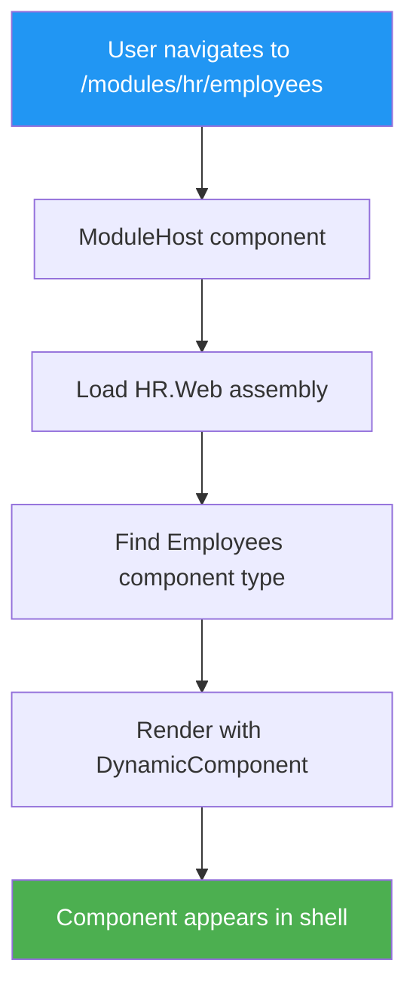

# No More Iframes - Dynamic Component Loading

## The Revelation

> **"Why does it need to be an iframe? All we are doing is injecting HTML."**

**You're absolutely right!** Iframes were unnecessary complexity. We can just load Blazor components directly.

## What Changed

### Before (Iframes)
```razor
<iframe src="http://localhost:5002/hr/employees" />
```

Problems:
- ❌ Cross-origin issues
- ❌ Theme sync complexity
- ❌ Separate ports/processes
- ❌ postMessage gymnastics
- ❌ Browser URL confusion

### After (Dynamic Components)
```razor
<DynamicComponent Type="@_componentType" />
```

Benefits:
- ✅ Single process
- ✅ Single port
- ✅ Shared theme context
- ✅ Direct component communication
- ✅ Clean URLs
- ✅ Simple routing

## Architecture



## How It Works

### 1. Shell References Module Projects

`BusinessAsUsual.Web.csproj`:
```xml
<ProjectReference Include="..\..\services\HR\HR.Web\HR.Web.csproj" />
```

The module assembly is **loaded into the same process**.

### 2. ModuleHost Loads Components Dynamically

```csharp
// Get the module assembly
var assembly = Assembly.Load("HR.Web");

// Find the component type
var componentType = assembly.GetType("HR.Web.Components.Pages.Employees");

// Render it
<DynamicComponent Type="@componentType" />
```

### 3. Routes Map to Components

| URL | Component Loaded |
|-----|------------------|
| `/modules/hr` | `HR.Web.Components.Pages.Home` |
| `/modules/hr/employees` | `HR.Web.Components.Pages.Employees` |
| `/modules/hr/departments` | `HR.Web.Components.Pages.Departments` |

## Component Convention

Modules must follow this structure:

```
{ModuleKey}.Web/
  Components/
	Pages/
	  Home.razor          ← Default component
	  Employees.razor     ← /employees route
	  Departments.razor   ← /departments route
```

## Code Changes

### ModuleHost.razor (Simplified)
```razor
@page "/modules/{ModuleKey}"
@page "/modules/{ModuleKey}/{*CatchAll}"

@if (_componentType != null)
{
	<DynamicComponent Type="@_componentType" />
}

@code {
	[Parameter] public string? ModuleKey { get; set; }
	[Parameter] public string? CatchAll { get; set; }

	private Type? _componentType;

	protected override async Task OnInitializedAsync()
	{
		// Load assembly: HR.Web
		var assembly = Assembly.Load($"{ModuleKey}.Web");

		// Determine component name from route
		var componentName = DetermineComponentName(CatchAll);

		// Load component type
		_componentType = assembly.GetType($"{ModuleKey}.Web.Components.Pages.{componentName}");
	}
}
```

### Removed Complexity
- ❌ No iframe URLs
- ❌ No cross-origin handling
- ❌ No postMessage bridge
- ❌ No theme sync scripts
- ❌ No navigation interceptors

### Simplified Projects
- `HR.Web` no longer needs to reference `BusinessAsUsual.Web`
- No circular dependencies
- Modules are truly independent (can still run standalone if needed)

## Benefits

### 1. Single Theme Context
All components share the same MudBlazor theme. No sync needed!

### 2. Direct Communication
Components can inject services from the shell or other modules.

### 3. Clean URLs
```
/modules/hr/employees  ← Clean, simple, works
```

### 4. Better Performance
No iframe overhead, no separate process, no network calls.

### 5. Easier Debugging
Everything in one process. Set breakpoints anywhere.

## URL Structure

```mermaid
graph LR
	A[/modules/hr] --> B[Load HR.Web assembly]
	A --> C[Render Home component]

	D[/modules/hr/employees] --> E[Load HR.Web assembly]
	D --> F[Render Employees component]

	G[/modules/accounting] --> H[Load Accounting.Web assembly]
	G --> I[Render Home component]

	style A fill:#2196F3,color:#fff
	style D fill:#2196F3,color:#fff
	style G fill:#2196F3,color:#fff
```

## Migration Path

### For Existing Modules
1. Add project reference from shell to module
2. Remove any iframe-specific code
3. Ensure components follow naming convention
4. Done!

### For New Modules
1. Create `{ModuleName}.Web` project
2. Add `Components/Pages/` folder
3. Create components following convention
4. Add project reference from shell
5. Register in Module Registry
6. Done!

## Trade-offs

### Pros
- ✅ Simpler architecture
- ✅ Better performance
- ✅ Shared context
- ✅ Easier debugging
- ✅ No cross-origin issues

### Cons
- ⚠️ All modules must be .NET/Blazor (no mixing technologies)
- ⚠️ Modules load in same process (one crash affects all)
- ⚠️ Must follow component naming conventions

## When To Use Iframes

Iframes still make sense for:
- 🌍 External applications (not yours)
- 🔧 Different technology stacks (Angular, React, Vue)
- 🔒 Strong isolation requirements
- 📦 Third-party widgets

But for **your own Blazor modules**? Dynamic component loading is simpler and better.

## Summary

**The Insight:** Iframes were solving a problem we didn't have.

**The Solution:** Load components directly. It's just .NET assemblies.

**The Result:** Simpler code, better performance, cleaner architecture.

**No more iframes. Just components.** 🎯
