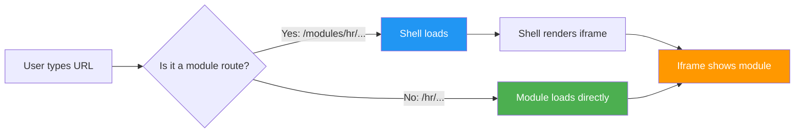
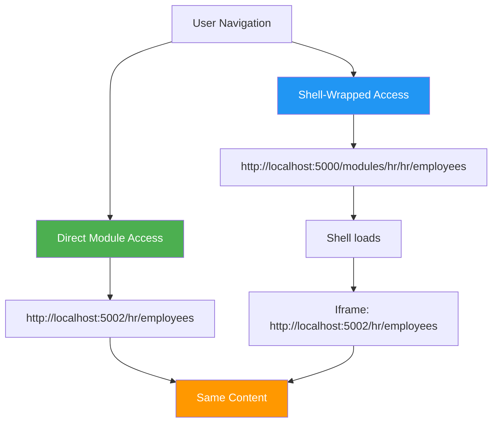
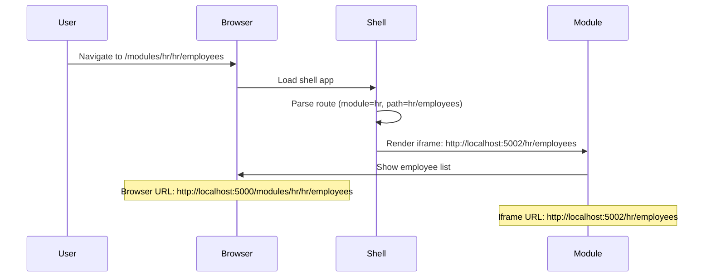

# Simple Navigation System

## Core Principle

**Every URL works standalone. The shell is optional chrome.**



## How It Works

### Module Apps Are Standalone

The HR module runs on `http://localhost:5002`:
- `/` → HR Dashboard
- `/hr/employees` → Employee List  
- `/hr/employees?id=123` → Employee Detail

**These URLs work directly.** No shell required.

### Shell Wraps Modules (Optional)

The parent shell runs on `http://localhost:5000` and has a catch-all route:

```
@page "/modules/{ModuleKey}/{*InternalRoute}"
```

When you navigate to `/modules/hr/hr/employees`:
1. Shell loads with sidebar, topbar, footer
2. Renders an iframe pointing to `http://localhost:5002/hr/employees`
3. That's it!

## URL Structure



| You Type | What Happens |
|----------|--------------|
| `http://localhost:5002/hr/employees` | Direct module access (no shell) |
| `http://localhost:5000/modules/hr/hr/employees` | Shell wraps module in iframe |
| `http://localhost:5000/dashboard` | Shell page (no iframe) |

## Implementation

### 1. ModuleHost.razor (Parent Shell)

```razor
@page "/modules/{ModuleKey}/{*InternalRoute}"

<iframe src="@_iframeUrl" />

@code {
	[Parameter] public string? ModuleKey { get; set; }
	[Parameter] public string? InternalRoute { get; set; }

	private string? _iframeUrl;

	protected override async Task OnInitializedAsync() {
		// Get module base URL from registry
		var module = await GetModule(ModuleKey);

		// Build iframe URL
		_iframeUrl = $"{module.BaseUrl}/{InternalRoute}";
	}
}
```

### 2. HR.Web App (Module)

Just a normal Blazor app. No special handling:

```razor
@page "/hr/employees"

<h1>Employees</h1>
<EmployeeList />
```

**That's it.** It works standalone AND in the shell.

## Navigation Flow



## Why This Works

### Links Just Work

Inside the module, regular links work:

```razor
<a href="/hr/employees">Employees</a>
```

- **Standalone:** Navigates to `http://localhost:5002/hr/employees`
- **In iframe:** Navigates iframe to `http://localhost:5002/hr/employees`

### Sharing Links Works

Someone sends you: `http://localhost:5002/hr/employees?id=123`

You open it → **It just works.** You see the employee detail page.

### Shell Links Work

Inside the shell, use module routes:

```razor
<a href="/modules/hr/hr/employees">View in Shell</a>
```

This loads the shell with the iframe showing the same content.

## Benefits

✅ **Module URLs are shareable** - send direct links to coworkers  
✅ **No complex interception** - iframe navigates naturally  
✅ **Works offline/locally** - modules are independent apps  
✅ **Simple debugging** - no postMessage gymnastics  
✅ **Progressive enhancement** - shell adds chrome, module works without it  

## Trade-offs

⚠️ **Browser URL doesn't update** when navigating inside iframe  
   - This is OK! The iframe URL is the source of truth
   - You can still copy/paste iframe URLs

⚠️ **Back/forward buttons** navigate iframe, not shell  
   - This is actually correct behavior
   - User is navigating within the module

## Deep Links

Want to open a specific module page in the shell?

```
http://localhost:5000/modules/hr/hr/employees?id=123
```

The shell:
1. Parses `ModuleKey = "hr"`, `InternalRoute = "hr/employees?id=123"`
2. Builds iframe URL: `http://localhost:5002/hr/employees?id=123`
3. Renders iframe

**The deep link works!**

## Summary

Stop fighting iframes. Let them navigate naturally.

The shell is just a **frame** around a **fully functional app**.

**Simple. Debuggable. Works.**

